# Katy Coin: The Complete Vision and Implementation Plan

## Executive Summary

Katy Coin is an edge-based barter platform that uses AI to track real-time market values across all goods and services, enabling anyone to trade anything (items, skills, time, or space) through a mutual credit system where 1 Katy Coin roughly equals $1 USD at launch. Built on Cloudflare’s infrastructure, it seamlessly connects neighbors for direct peer-to-peer exchanges while small businesses can accept KC alongside cash through existing POS systems, with all trades automatically tax-documented and settled through smart matching algorithms. Starting in Saint Charles, Missouri and expanding along the historic Katy Railroad route, it creates resilient local economies where your hour of work has immediate value, breaking the wage-slave trap and ensuring communities thrive regardless of currency stability.

## Historical Connection & Vision

### The Katy Trail Legacy

- The original Missouri-Kansas-Texas (MKT/“Katy”) Railroad connected communities across America, enabling commerce where none existed before
- Just as the railroad transformed isolated towns into thriving trade centers, Katy Coin will connect economic islands
- The Katy Trail today brings people together for recreation - Katy Coin brings them together for economic liberation

### Timeline Parallel

```
1858: Katy Railroad starts in Missouri
2025: Katy Coin starts in Saint Charles

1870s: Rails connect Missouri to Texas  
2020s: Digital rails connect neighbor to neighbor

1890s: Farmers ship goods nationwide
2030s: Everyone trades skills nationwide
```

### Core Taglines

- **“Your Skills Are Currency”**
- **“Trade Local, Think National”**
- **“Riding the Rails of Economic Freedom”**
- **“From the Katy Trail to Your Trail”**
- **“Where Every Hour Has Value”**

## Three-Layer System Architecture

### Layer 1: Market Intelligence (Value Discovery)

```javascript
class MarketIntelligence {
  purpose: "Know what everything is worth",
  components: [
    'Price scraping agents (Amazon, eBay, local markets)',
    'AI product identification',
    'Dynamic seasonal adjustments',
    'Service valuation engine'
  ],
  updates: 'Real-time via Cloudflare Workers'
}
```

### Layer 2: Barter Exchange (Value Movement)

```javascript
class BarterExchange {
  purpose: "Enable frictionless peer-to-peer trades",
  components: [
    'Multi-party trade matching',
    'Smart escrow system',
    'Reputation tracking',
    'Dispute resolution'
  ],
  execution: 'Edge-based for instant trades'
}
```

### Layer 3: Katy Coin (Value Storage)

```javascript
class KatyCoin {
  purpose: "Track and balance value over time",
  components: [
    'Mutual credit system',
    'Time banking integration',
    'Community pools',
    'Inter-community bridges'
  ],
  settlement: 'Daily blockchain anchoring'
}
```

## Digital Currency Architecture

### Base Units

```
1 Katy (K) = Base unit (roughly $1 USD equivalent at launch)
1 Rail = 0.01 Katy (like cents)
Time Credits (TC) = 1 hour baseline labor = 15-25 Katy (dynamic)
```

### Triple-Entry Ledger System

```javascript
Transaction {
  id: "txn_abc123",
  from: "user_alice",
  to: "user_bob",
  amount: 50.00,
  type: "goods_exchange",
  
  // The innovation - community stake
  communityPool: 0.50, // 1% to community
  
  entries: [
    {account: "alice", debit: 50.00},
    {account: "bob", credit: 50.00},
    {account: "community_saint_charles", credit: 0.50}
  ],
  
  metadata: {
    fairMarketValue: "$50.00",
    itemsTraded: ["vintage_bike"],
    location: {lat, lng},
    timestamp: Date.now()
  }
}
```

## Currency Issuance Models

### 1. Mutual Credit Creation (Primary)

- Currency created at moment of trade
- Both parties can go negative to a limit
- No central money supply

```javascript
// Alice has 0 KC, Bob has 0 KC
// Alice provides service worth 50 KC to Bob
// Result: Alice +50 KC, Bob -50 KC
// Total system currency: still 0 (mutual credit)
```

### 2. Time Mining (Secondary)

- Verified community service generates KC
- Teaching, emergency response, community projects
- Capped at 10% of trade volume to prevent inflation

### 3. Onboarding Grants (Bootstrap)

New users receive 5-20 KC based on:

- Identity verification level
- Community vouch score
- Skills registered
- Items listed

## Value Stabilization Mechanisms

### Demurrage (Use It or Lose It)

```javascript
const DEMURRAGE_RATE = 0.02; // 2% per month
const DEMURRAGE_START = 90; // Days before demurrage kicks in
const DEMURRAGE_CAP = 1000; // KC exempt from demurrage
```

### Local Economic Zones

```javascript
const economicZones = {
  'saint_charles': {
    demurrageRate: 0.02,
    communityFee: 0.01,
    timeValue: 20, // KC per hour
    localMultiplier: 1.1 // 10% bonus for local trades
  },
  
  'columbia_mo': {
    demurrageRate: 0.015,
    communityFee: 0.015,
    timeValue: 18,
    studentDiscount: 0.9 // Universities
  }
};
```

### Distance-Based Value Adjustments

```javascript
function calculateTradeValue(base, fromLocation, toLocation) {
  const distance = haversine(fromLocation, toLocation);
  
  if (distance < 1) return base * 1.15;      // Same neighborhood bonus
  if (distance < 5) return base * 1.10;      // Local bonus  
  if (distance < 25) return base * 1.05;     // Regional bonus
  if (distance < 100) return base;           // Normal
  return base * 0.95;                        // Distance penalty
}
```

## Donut Economics Features

### Universal Basic Services (UBS) Pool

```javascript
class UniversalBasicServices {
  constructor() {
    this.essentials = [
      'food', 'shelter_repair', 'healthcare_transport', 
      'childcare', 'elder_care', 'education', 'connectivity'
    ];
  }
  
  async monthlyDistribution() {
    // Everyone gets monthly essential credits
    const allUsers = await this.getAllActiveUsers();
    
    for (const user of allUsers) {
      // Base allocation + need multiplier
      const baseCredits = 50; // KC per month
      const needMultiplier = await this.calculateNeed(user);
      
      await this.distribute({
        userId: user.id,
        amount: baseCredits * needMultiplier,
        restricted: true, // Can only spend on essentials
        expires: 30, // Use it or lose it
        source: 'community_dividend'
      });
    }
  }
}
```

### Community Wealth Building

- 1% of every transaction goes to community pool
- Democratic allocation of community funds
- Funding for public goods and services
- Emergency response reserves
- Local business incubation support

## Multi-Party Settlement Engine

### Complex Trade Resolution

```javascript
class MultiPartySettlement {
  async findCircularTrade(wants, offers) {
    // Alice wants bread, offers tutoring
    // Bob wants tutoring, offers bike repair
    // Carol wants bike repair, offers bread
    
    const graph = this.buildTradeGraph(wants, offers);
    const cycles = this.findTradeCycles(graph);
    
    return this.optimizeTradeRoute(cycles);
  }
}
```

## Crisis Response Modes

```javascript
class CrisisResponse {
  async activateEmergencyMode(region, type) {
    const config = {
      naturalDisaster: {
        demurrageSuspended: true,
        emergencyIssuance: 100, // KC per verified resident
        priorityGoods: ['water', 'food', 'shelter', 'medical'],
        surgePricingCap: 1.5 // Max 50% increase
      },
      
      economicCrisis: {
        negativeLimit: -1000, // Increase credit limits
        timeValue: 30, // Increase time credit value
        communityFee: 0, // Suspend fees
      }
    };
    
    await this.applyConfig(region, config[type]);
    await this.notifyResidents(region, type);
  }
}
```

## Hybrid Blockchain Architecture

### Edge Computing (99% of Activity)

- Real-time transactions (<100ms)
- $0.0001 per transaction cost
- Full privacy control
- Instant updates and flexibility

### Blockchain Settlement (1% of Activity)

- Daily settlement batches on Polygon PoS
- Merkle root anchoring
- Inter-community trust bridges
- Reputation checkpoints
- Disaster recovery snapshots

### What Goes on Blockchain

- Settlement finality (daily/weekly)
- Inter-community bridges
- Reputation anchoring
- Governance tokens (if needed)
- Disaster recovery checkpoints

### What Stays on Edge

- All real-time transactions
- Price discovery
- User data
- Matching algorithms
- 99.9% of system operations

## Business Integration Features

### POS System Integration

```javascript
// Square/Clover/PayPal Plugin
class KatyCoinPOS {
  async processHybridPayment(total) {
    const options = [
      { cash: total * 1.0, kc: 0 },
      { cash: total * 0.7, kc: total * 0.3 },
      { cash: total * 0.5, kc: total * 0.5 },
      { cash: 0, kc: total * 0.9 } // 10% discount for full KC
    ];
    
    return await customer.selectPaymentMix(options);
  }
}
```

### Business Features

- Inventory value tracking
- Customer trade history
- Supplier barter accounts
- Employee benefit trading
- Tax documentation automation
- Cash flow bridging options

## Individual Participation Methods

### Skills & Services Trading

```javascript
class SkillRegistry {
  categories = {
    professional: ['tutoring', 'consulting', 'design', 'programming'],
    trades: ['plumbing', 'electrical', 'carpentry', 'auto_repair'],
    personal: ['haircuts', 'massage', 'fitness_training'],
    creative: ['music_lessons', 'art_classes', 'photography'],
    everyday: ['babysitting', 'pet_care', 'house_cleaning', 'lawn_care']
  };
}
```

### Time Banking Integration

- 1 hour baseline = 15-25 KC (location dependent)
- Skill level multipliers (apprentice to master)
- Future service booking
- Time credit accumulation

### Asset Sharing

- Tool libraries
- Parking space rental
- Storage sharing
- Equipment time-sharing
- Energy trading (solar excess)

## Trust & Safety Systems

### Progressive Identity Verification

1. **Basic** (Email/Phone): 5 KC limit
2. **Standard** (ID Verified): 100 KC limit
3. **Enhanced** (Address + References): 500 KC limit
4. **Full** (Background Check): Unlimited

### Fraud Prevention

- ML-based behavior analysis
- Device fingerprinting
- Velocity checks
- Community reporting
- Escrow for new users
- Witness requirements for high-value trades

### Dispute Resolution

1. AI-suggested resolutions
2. Community mediator network
3. Binding arbitration option
4. Insurance fund coverage
5. Platform intervention (last resort)

### Liability Protection

```javascript
class LiabilityProtection {
  const RISK_CATEGORIES = {
    HIGH: ['electrical', 'plumbing', 'structural', 'medical', 'childcare'],
    MEDIUM: ['auto_repair', 'appliance_repair', 'tree_service'],
    LOW: ['tutoring', 'cleaning', 'gardening', 'art']
  };
  
  // Mandatory insurance pool contributions
  const poolContribution = {
    HIGH: 0.05,   // 5% of earnings
    MEDIUM: 0.02, // 2% of earnings  
    LOW: 0.01     // 1% of earnings
  };
}
```

## Regulatory Compliance Framework

### Tax Compliance

- Automated 1099-B generation for trades over $600/year
- Fair market value tracking
- Transaction categorization
- Export to tax software
- Audit trail maintenance

### Legal Structure

- Marketplace facilitator model (not money transmitter)
- Clear platform vs. user liability separation
- Terms of service enforcement
- Insurance requirements for high-risk services
- License verification for regulated services

### Proactive Compliance

- State-by-state regulatory engagement
- Regulatory sandbox participation
- MSB registration where required
- Automated jurisdiction detection
- Compliance dashboard for users

## Expansion Strategy

### Phase 1: Katy Trail Communities

```mermaid
flowchart TD
    A[🚂 Phase 1: Katy Trail Communities] --> B[🏠 Saint Charles - HQ/Start]
    A --> C[🍇 Augusta]
    A --> D[🏔️ Defiance]
    A --> E[🌊 Rocheport]
    A --> F[🏛️ Boonville]
    A --> G[🌟 Clinton]
```



### Phase 2: Missouri Hub Cities

```mermaid
flowchart TD
    A[🌆 Phase 2: Missouri Hub Cities] --> B[🌉 St. Louis Metro]
    A --> C[🎓 Columbia]
    A --> D[🏛️ Jefferson City]
    A --> E[🌃 Kansas City]
```



### Phase 3: Original Katy Railroad Route

```mermaid
flowchart TD
    A[🚂 Phase 3: Original Katy Railroad Route] --> B[🌾 Kansas]
    A --> C[🛢️ Oklahoma]
    A --> D[⭐ Texas]
```



### Phase 4: National Rail Network

```mermaid
flowchart TD
    A[🌍 Phase 4: National Rail Network] --> B[🚂 Every former railroad town in America]
    
    style A fill:#e1f5fe
    style B fill:#f3e5f5
```



## Launch Timeline

### Month 1-2: Foundation

- Legal entity formation (B Corp or Cooperative)
- Core team hiring
- Cloudflare architecture setup
- Basic web interface

### Month 3-4: MVP

- Simple goods-for-goods trading
- Basic KC implementation
- 100 beta users in Saint Charles
- Manual dispute resolution

### Month 5-6: Intelligence Layer

- Market scraping active
- AI valuation online
- Service trading enabled
- Mobile apps launched

### Month 7-9: Scale

- Multi-party trades
- Time banking integration
- 1,000 active users
- First blockchain settlement

### Month 10-12: Network Effects

- Business integrations live
- Inter-community bridges
- 10,000 users
- Revenue model active

## Revenue Model

1. **Transaction Fees**: 1-2% per trade (after free tier)
2. **Premium Features**: Advanced analytics, priority matching
3. **Business Subscriptions**: POS integration, bulk tools
4. **Insurance Products**: Trade protection, liability coverage
5. **Data Insights**: Anonymized market trends (with consent)

## Solutions to Major Challenges

### Tax Compliance

✅ **SOLVED**: Automated 1099-B generation, fair market value tracking, user attestation

### Initial Liquidity

✅ **SOLVED**: Time credit grants, multi-party matching, progressive trust building

### Fraud Prevention

✅ **SOLVED**: Escrow system, ML detection, community vouching, reputation stakes

### Dispute Resolution

✅ **SOLVED**: AI mediation, community arbitrators, insurance pools

### Regulatory Risk

✅ **SOLVED**: Marketplace model, proactive engagement, compliance automation

### Platform Lock-in

✅ **SOLVED**: Open source core, multiple integrations, decentralized architecture

### “Bank Run” Scenarios

✅ **SOLVED**: Circuit breakers, exit queues, community reserves, value preservation

## Why This Works When USD Fails

### 1. No External Dependencies

- Value determined by local supply/demand, not USD
- Community consensus replaces central bank
- Mutual credit creates liquidity without printing

### 2. Anti-Fragile Design

- Crisis makes system stronger (people trade more)
- Local resilience built in
- Multiple fallback mechanisms

### 3. Human-Centric

- Trust through relationships, not institutions
- Value includes time, skills, community contribution
- Measures success in wellbeing, not profit

## Community Benefits

### Economic Liberation

- Break the wage slave trap
- Every skill has immediate value
- No middleman extraction
- Local wealth circulation

### Social Capital

- Neighbor-to-neighbor connections
- Skill sharing and learning
- Community resilience
- Mutual aid networks

### Environmental Impact

- Reduced consumption through sharing
- Repair over replacement
- Local trade reduces transport
- Circular economy principles

## The Bottom Line

Katy Coin solves every major concern through:

- **Technology**: Edge computing + AI + blockchain (where needed)
- **Economics**: Mutual credit + time banking + market intelligence
- **Community**: Progressive trust + local focus + donut economics
- **Compliance**: Automated tax reporting + proper legal structure

This isn’t just a barter app - it’s economic infrastructure for the post-USD world, starting in Saint Charles and spreading along the rails of human connection across America.

**The revolution begins with neighbors trading bread for bike repairs, and ends with communities that thrive regardless of what currency does.**

-----

*“Just as the Katy Railroad once connected America’s heartland for commerce, Katy Coin reconnects communities for true economic freedom. No banks, no middlemen - just neighbors helping neighbors, spreading from the trails of Missouri to every Main Street in America.”*