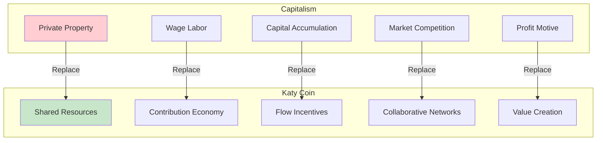
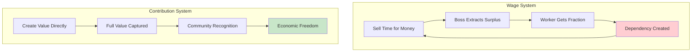
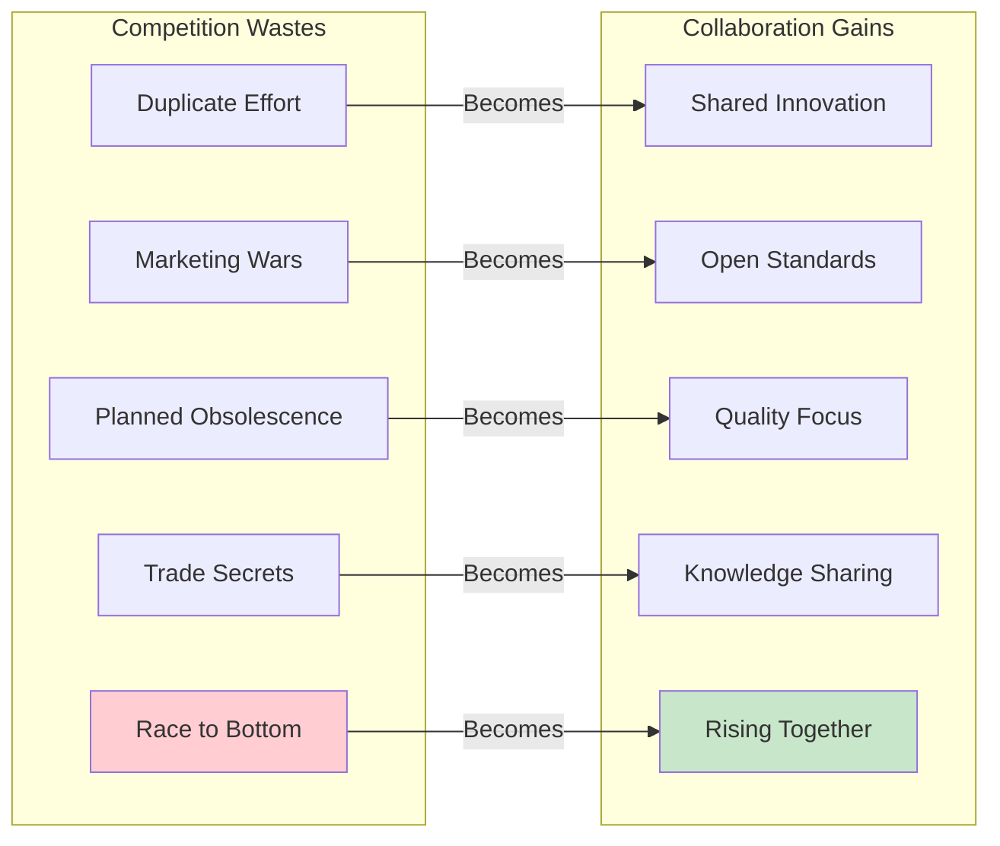
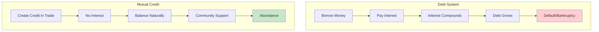

# 🔄 Replacing Capitalism

## Summary

Katy Coin systematically replaces each pillar of capitalism with sustainable, community-driven alternatives. This document maps how we transform exploitation into collaboration, scarcity into abundance, and competition into cooperation—creating an economy that serves humanity instead of enslaving it.

## 📑 Table of Contents

- [The Five Pillars We're Replacing](#-the-five-pillars-were-replacing)
- [Private Property → Shared Resources](#-private-property--shared-resources)
- [Wage Labor → Contribution Economy](#-wage-labor--contribution-economy)
- [Capital Accumulation → Flow Incentives](#-capital-accumulation--flow-incentives)
- [Market Competition → Collaborative Networks](#-market-competition--collaborative-networks)
- [Profit Maximization → Value Optimization](#-profit-maximization--value-optimization)
- [Debt & Interest → Mutual Credit](#-debt--interest--mutual-credit)
- [Artificial Scarcity → Managed Abundance](#-artificial-scarcity--managed-abundance)
- [Exploitation → Reciprocity](#-exploitation--reciprocity)
- [GDP Growth → Wellbeing Metrics](#-gdp-growth--wellbeing-metrics)
- [Corporate Power → Community Governance](#-corporate-power--community-governance)
- [Transition Strategy](#-transition-strategy)

## 🏛️ The Five Pillars We're Replacing



## 🏠 Private Property → Shared Resources

### The Problem with Private Property

```javascript
const privatePropertyProblems = {
  monopolization: {
    issue: "Resources controlled by few",
    impact: "Artificial scarcity, high prices",
    example: "Housing crisis despite empty homes"
  },
  
  exploitation: {
    issue: "Ownership enables rent-seeking",
    impact: "Wealth extraction without value creation",
    example: "Landlords profiting from housing needs"
  },
  
  inequality: {
    issue: "Wealth concentrates generationally",
    impact: "Permanent underclass",
    example: "1% owns 50% of global wealth"
  },
  
  inefficiency: {
    issue: "Idle resources while people suffer",
    impact: "Waste and want coexist",
    example: "Empty offices while homeless freeze"
  }
};
```

### The Shared Resource Solution

```javascript
class SharedResourceNetwork {
  constructor() {
    this.resources = new Map();
    this.usageRights = new Map();
    this.communityAssets = [];
  }
  
  // Transform ownership to access rights
  registerSharedResource(resource) {
    const sharedResource = {
      id: crypto.randomUUID(),
      type: resource.type,
      location: resource.location,
      capacity: resource.capacity,
      currentUsers: [],
      schedule: new Map(),
      maintenanceFund: 0,
      governance: 'community'
    };
    
    this.resources.set(sharedResource.id, sharedResource);
    
    // Previous owner gets priority access rights
    if (resource.previousOwner) {
      this.grantPriorityAccess(
        resource.previousOwner,
        sharedResource.id,
        0.3 // 30% priority
      );
    }
    
    return sharedResource;
  }
  
  // Democratic resource allocation
  allocateResource(resourceId, requests) {
    const resource = this.resources.get(resourceId);
    const allocation = new Map();
    
    // Sort by need score
    const scored = requests.map(req => ({
      ...req,
      score: this.calculateNeedScore(req)
    })).sort((a, b) => b.score - a.score);
    
    // Allocate based on capacity and need
    let remainingCapacity = resource.capacity;
    for (const request of scored) {
      if (remainingCapacity >= request.amount) {
        allocation.set(request.userId, {
          amount: request.amount,
          priority: request.score,
          duration: request.duration
        });
        remainingCapacity -= request.amount;
      }
    }
    
    return allocation;
  }
  
  // Stewardship rewards instead of ownership profits
  rewardStewardship(userId, resourceId, quality) {
    const reward = {
      maintainer: userId,
      resource: resourceId,
      qualityScore: quality,
      kcReward: quality * 10, // KC for good maintenance
      trustBoost: quality * 5,
      communityRecognition: true
    };
    
    // Good stewards get future priority
    if (quality > 0.8) {
      this.grantPriorityAccess(userId, resourceId, 0.1);
    }
    
    return reward;
  }
  
  // Community ownership of essential services
  createCommunityAsset(asset) {
    const communityAsset = {
      id: crypto.randomUUID(),
      name: asset.name,
      type: asset.type, // housing, energy, food, transport
      value: asset.value,
      shares: new Map(), // Community members own shares
      decisions: [], // Democratic decision log
      profits: 0, // Reinvested in community
      publicGood: true
    };
    
    // Distribute ownership to community
    const members = this.getCommunityMembers();
    for (const member of members) {
      communityAsset.shares.set(member.id, {
        percentage: 1 / members.length,
        votingPower: 1,
        dividends: 0
      });
    }
    
    this.communityAssets.push(communityAsset);
    return communityAsset;
  }
}
```

## 💼 Wage Labor → Contribution Economy

### The Wage Slavery Problem



### Contribution-Based Economy

```javascript
class ContributionEconomy {
  // Value creation without employment
  recordContribution(contribution) {
    const value = {
      contributor: contribution.userId,
      type: contribution.type,
      description: contribution.description,
      beneficiaries: contribution.beneficiaries || 'community',
      timestamp: Date.now(),
      
      // Multiple value metrics
      economicValue: this.calculateEconomicValue(contribution),
      socialValue: this.calculateSocialValue(contribution),
      environmentalValue: this.calculateEnvironmentalValue(contribution),
      culturalValue: this.calculateCulturalValue(contribution),
      
      // Immediate rewards
      kcReward: 0,
      reputationBoost: 0,
      accessRights: [],
      recognition: []
    };
    
    // Calculate fair compensation
    value.kcReward = this.calculateFairReward(value);
    
    // No boss taking cut - full value to creator
    this.distributeReward(value.contributor, value.kcReward);
    
    // Community validation instead of boss approval
    this.requestCommunityValidation(value);
    
    return value;
  }
  
  // Replace jobs with roles
  createCommunityRole(role) {
    return {
      id: crypto.randomUUID(),
      title: role.title,
      purpose: role.purpose,
      responsibilities: role.responsibilities,
      
      // Not employment terms
      notA: {
        job: true, // This is not a job
        position: true, // No hierarchy
        employment: true // No employer/employee
      },
      
      // But rather
      isA: {
        contribution: true,
        service: true,
        calling: true,
        practice: true
      },
      
      // Flexible engagement
      commitment: {
        minimum: role.minimumHours || 0,
        maximum: role.maximumHours || Infinity,
        flexible: true,
        selfDirected: true
      },
      
      // Community support not wages
      support: {
        basicIncome: 1000, // KC per month base
        contributionBonus: 'unlimited',
        resourceAccess: role.resources,
        education: 'provided',
        healthcare: 'included',
        housing: 'guaranteed'
      }
    };
  }
  
  // Worker cooperatives instead of corporations
  createCooperative(coop) {
    const cooperative = {
      id: crypto.randomUUID(),
      name: coop.name,
      mission: coop.mission,
      
      // Democratic structure
      governance: {
        type: 'democratic',
        voting: 'one-member-one-vote',
        decisions: 'consensus-seeking',
        leadership: 'rotating'
      },
      
      // Shared ownership
      ownership: {
        type: 'collective',
        shares: new Map(), // Equal shares
        profits: 'shared-equally',
        losses: 'shared-equally'
      },
      
      // No wage labor
      compensation: {
        type: 'profit-sharing',
        formula: 'equal-split',
        minimum: coop.minimumShare || 1000,
        maximum: coop.maximumRatio || 3 // Max 3:1 pay ratio
      },
      
      members: []
    };
    
    return cooperative;
  }
  
  // Passion economy enablement
  enablePassionEconomy(user) {
    const passions = this.identifyPassions(user);
    const opportunities = [];
    
    for (const passion of passions) {
      // Find ways to contribute through passion
      const ways = this.findContributionPaths(passion);
      
      // Calculate potential value
      const potential = {
        passion: passion.name,
        weeklyHours: passion.availableTime,
        estimatedValue: passion.skillLevel * 100,
        communityNeed: this.assessNeed(passion.name),
        
        // Support available
        mentorship: this.findMentors(passion.name),
        resources: this.findResources(passion.name),
        community: this.findCommunity(passion.name),
        
        // Potential KC earnings
        monthlyKC: passion.availableTime * 4 * passion.skillLevel * 10
      };
      
      opportunities.push(potential);
    }
    
    return {
      user: user.id,
      passions,
      opportunities,
      projectedIncome: opportunities.reduce((sum, o) => sum + o.monthlyKC, 0),
      message: "Follow your passion, serve your community, thrive economically"
    };
  }
}
```

## 💰 Capital Accumulation → Flow Incentives

### The Hoarding Problem

```javascript
const accumulationProblems = {
  hoarding: {
    behavior: "Rich accumulate endlessly",
    result: "Money removed from circulation",
    impact: "Economic stagnation"
  },
  
  inequality: {
    behavior: "Capital generates more capital",
    result: "Exponential wealth concentration",
    impact: "Systemic poverty"
  },
  
  misallocation: {
    behavior: "Capital seeks highest return",
    result: "Speculation over production",
    impact: "Bubbles and crashes"
  }
};
```

### Flow-Based Economics

```javascript
class FlowEconomics {
  constructor() {
    this.demurrageRate = 0.02; // 2% monthly
    this.velocityTarget = 10; // Transactions per KC per month
    this.circulationRewards = new Map();
  }
  
  // Negative interest on idle money (demurrage)
  applyDemurrage(account) {
    const balance = account.balance;
    const lastActivity = account.lastTransaction;
    const idleDays = (Date.now() - lastActivity) / (1000 * 60 * 60 * 24);
    
    if (balance > 1000 && idleDays > 30) {
      // Apply demurrage to amounts over 1000 KC
      const excess = balance - 1000;
      const demurrage = excess * this.demurrageRate * (idleDays / 30);
      
      // Reduce balance
      account.balance -= demurrage;
      
      // Redistribute to active users
      this.redistributeDemurrage(demurrage);
      
      // Notify user
      this.sendNotification(account.userId, {
        type: 'demurrage',
        amount: demurrage,
        reason: 'Excess idle balance',
        suggestion: 'Use it or lose it! Find what you need in the marketplace.'
      });
      
      return demurrage;
    }
    
    return 0;
  }
  
  // Reward high velocity money
  rewardCirculation(userId) {
    const velocity = this.calculateVelocity(userId);
    
    if (velocity > this.velocityTarget) {
      const reward = {
        userId,
        velocity,
        kcBonus: (velocity - this.velocityTarget) * 10,
        trustBoost: velocity * 2,
        badge: this.getVelocityBadge(velocity),
        recognition: 'Economic Energizer'
      };
      
      this.distributeReward(userId, reward.kcBonus);
      this.circulationRewards.set(userId, reward);
      
      return reward;
    }
    
    return null;
  }
  
  // Wealth caps and floors
  enforceWealthLimits(account) {
    const limits = {
      floor: 0, // Can't go below 0
      softCap: 10000, // Increased demurrage
      hardCap: 100000 // Maximum possible
    };
    
    // Ensure minimum dignity
    if (account.balance < limits.floor) {
      const universalBasic = 100; // Monthly UBI
      account.balance = universalBasic;
      this.recordUBI(account.userId, universalBasic);
    }
    
    // Progressive demurrage above soft cap
    if (account.balance > limits.softCap) {
      const excess = account.balance - limits.softCap;
      const progressiveRate = this.demurrageRate * (1 + excess / limits.softCap);
      const demurrage = excess * progressiveRate;
      
      account.balance -= demurrage;
      this.redistributeDemurrage(demurrage);
    }
    
    // Hard cap enforcement
    if (account.balance > limits.hardCap) {
      const overflow = account.balance - limits.hardCap;
      account.balance = limits.hardCap;
      
      // Force spending or donation
      this.createSpendingIncentive(account.userId, overflow);
    }
    
    return account;
  }
  
  // Gift economy features
  enableGiftEconomy() {
    return {
      // Gifting is rewarded more than trading
      giftMultiplier: 1.5,
      
      // Reputation from generosity
      calculateGenerosity: (user) => {
        const gifts = this.getUserGifts(user);
        return gifts.reduce((score, gift) => score + gift.value * 1.5, 0);
      },
      
      // Paying it forward chains
      createGiftChain: (initialGift) => {
        const chain = {
          id: crypto.randomUUID(),
          origin: initialGift,
          links: [],
          totalValue: initialGift.value,
          participants: [initialGift.giver, initialGift.receiver]
        };
        
        // Track gift chains for bonus rewards
        this.trackGiftChain(chain);
        
        return chain;
      },
      
      // Potlatch events - competitive generosity
      organizePotlatch: (community) => {
        const event = {
          id: crypto.randomUUID(),
          community,
          date: new Date(),
          participants: [],
          gifts: [],
          winner: null // Most generous person
        };
        
        // Winner gets maximum reputation
        this.schedulePotlatch(event);
        
        return event;
      }
    };
  }
}
```

## 🤝 Market Competition → Collaborative Networks

### Competition's Failures



### Collaborative Market Design

```javascript
class CollaborativeMarkets {
  // Open source everything
  createOpenInnovation(innovation) {
    const open = {
      id: crypto.randomUUID(),
      name: innovation.name,
      description: innovation.description,
      
      // No intellectual property
      license: 'Public Domain',
      patents: 'None - Anti-Patent',
      copyright: 'Copyleft',
      
      // Shared development
      repository: 'github.com/katycoin/' + innovation.name,
      contributors: [],
      forks: [],
      improvements: [],
      
      // Recognition not ownership
      credit: {
        originator: innovation.creator,
        contributors: new Map(),
        citedBy: []
      },
      
      // Community funding
      funding: {
        type: 'crowdfund',
        raised: 0,
        target: innovation.fundingGoal,
        backers: []
      }
    };
    
    // Reward sharing innovations
    this.rewardOpenSource(innovation.creator, 1000);
    
    return open;
  }
  
  // Cooperative networks instead of competing firms
  createCooperativeNetwork(sector) {
    const network = {
      id: crypto.randomUUID(),
      sector, // e.g., 'food', 'housing', 'transport'
      
      // Federated structure
      structure: {
        type: 'federation',
        nodes: [], // Local cooperatives
        coordination: 'democratic',
        decisions: 'consensus'
      },
      
      // Shared resources
      commons: {
        knowledge: new Map(),
        tools: new Map(),
        suppliers: new Map(),
        customers: new Map()
      },
      
      // Collaborative practices
      practices: {
        pricing: 'transparent-cost-plus',
        quality: 'highest-sustainable',
        innovation: 'shared-immediately',
        problems: 'solved-together'
      },
      
      // Network effects
      benefits: {
        economiesOfScale: true,
        sharedRiskPool: true,
        collectiveBargaining: true,
        knowledgeTransfer: true
      }
    };
    
    return network;
  }
  
  // Replace competition with gamification
  createCollaborativeGames() {
    return {
      // Quality competitions
      qualityChallenge: {
        goal: 'Best product/service',
        reward: 'Recognition + 1000 KC',
        judging: 'Community voting',
        sharing: 'Winner shares methods'
      },
      
      // Innovation hackathons
      innovationSprint: {
        goal: 'Solve community problem',
        reward: 'Implementation support',
        judging: 'Impact assessment',
        sharing: 'All solutions open sourced'
      },
      
      // Efficiency games
      efficiencyDrive: {
        goal: 'Reduce waste/cost',
        reward: 'Savings shared with innovator',
        judging: 'Measured results',
        sharing: 'Methods taught to all'
      },
      
      // Service olympics
      serviceGames: {
        goal: 'Highest customer satisfaction',
        reward: 'Service Excellence Badge',
        judging: 'Customer feedback',
        sharing: 'Best practices workshop'
      }
    };
  }
  
  // Abundance protocols
  implementAbundanceProtocols() {
    return {
      // Share excess automatically
      surplusSharing: (producer, surplus) => {
        const distribution = {
          community: surplus * 0.3, // 30% to community
          commons: surplus * 0.2, // 20% to commons
          reserves: surplus * 0.2, // 20% to emergency reserves
          producer: surplus * 0.3 // 30% to producer
        };
        
        this.distributeSurplus(distribution);
        return distribution;
      },
      
      // Open recipes and methods
      openMethodology: (method) => {
        const shared = {
          id: crypto.randomUUID(),
          method,
          implementations: [],
          improvements: [],
          localizations: [] // Adapted to local conditions
        };
        
        this.publishMethod(shared);
        return shared;
      },
      
      // Resource pooling
      poolResources: (resources) => {
        const pool = {
          id: crypto.randomUUID(),
          resources,
          members: [],
          allocation: 'need-based',
          governance: 'democratic'
        };
        
        this.createResourcePool(pool);
        return pool;
      }
    };
  }
}
```

## 📈 Profit Maximization → Value Optimization

### Beyond Profit

```javascript
class ValueOptimization {
  // Multi-dimensional value metrics
  calculateTotalValue(activity) {
    const dimensions = {
      economic: this.economicValue(activity),
      social: this.socialValue(activity),
      environmental: this.environmentalValue(activity),
      cultural: this.culturalValue(activity),
      spiritual: this.spiritualValue(activity),
      health: this.healthValue(activity),
      educational: this.educationalValue(activity),
      emotional: this.emotionalValue(activity)
    };
    
    // Weighted by community priorities
    const weights = this.getCommunityWeights();
    
    let totalValue = 0;
    for (const [dimension, value] of Object.entries(dimensions)) {
      totalValue += value * (weights[dimension] || 0.125);
    }
    
    return {
      total: totalValue,
      breakdown: dimensions,
      optimal: totalValue > this.getOptimalThreshold()
    };
  }
  
  // Triple bottom line accounting
  tripleBottomLine(organization) {
    return {
      people: {
        employees: this.assessEmployeeWellbeing(organization),
        customers: this.assessCustomerSatisfaction(organization),
        community: this.assessCommunityImpact(organization),
        suppliers: this.assessSupplierRelations(organization)
      },
      
      planet: {
        carbon: this.calculateCarbonFootprint(organization),
        waste: this.assessWasteGeneration(organization),
        resources: this.assessResourceEfficiency(organization),
        biodiversity: this.assessBiodiversityImpact(organization)
      },
      
      prosperity: {
        revenue: organization.revenue,
        localSpending: this.calculateLocalImpact(organization),
        jobsCreated: organization.employees.length,
        innovation: this.assessInnovation(organization),
        resilience: this.assessResilience(organization)
      },
      
      // New Katy Coin specific metrics
      purpose: {
        missionAlignment: this.assessMissionAlignment(organization),
        communityValue: this.assessCommunityValue(organization),
        systemicChange: this.assessSystemicImpact(organization)
      }
    };
  }
  
  // Regenerative business models
  createRegenerativeModel(business) {
    return {
      // Give more than you take
      principle: 'regenerative',
      
      operations: {
        inputs: 'renewable-only',
        processes: 'zero-waste',
        outputs: 'beneficial',
        externalities: 'positive'
      },
      
      stakeholders: {
        workers: 'owner-partners',
        customers: 'community-members',
        suppliers: 'ecosystem-partners',
        nature: 'primary-stakeholder'
      },
      
      metrics: {
        success: 'ecosystem-health',
        growth: 'capability-increase',
        profit: 'shared-value-created',
        legacy: 'seven-generations'
      },
      
      practices: {
        hiring: 'inclusive-opportunity',
        pricing: 'accessible-fair',
        innovation: 'biomimicry',
        governance: 'sociocracy'
      }
    };
  }
}
```

## 💸 Debt & Interest → Mutual Credit

### The Debt Trap



### Zero-Interest Credit System

```javascript
class MutualCreditSystem {
  // Credit created by trade, not loans
  createTradeCredit(trade) {
    const credit = {
      id: crypto.randomUUID(),
      type: 'mutual-credit',
      
      // No pre-existing money needed
      created: {
        amount: trade.value,
        buyer: trade.buyer,
        seller: trade.seller,
        timestamp: Date.now()
      },
      
      // Zero interest always
      interest: 0,
      fees: 0,
      
      // Self-liquidating
      lifecycle: {
        creation: 'at-trade',
        existence: 'until-balanced',
        destruction: 'when-cleared'
      },
      
      // Community backing
      guarantee: {
        type: 'mutual',
        pool: 'community-fund',
        riskSharing: 'collective'
      }
    };
    
    // Update balances
    this.updateBalance(trade.buyer, -trade.value);
    this.updateBalance(trade.seller, +trade.value);
    
    // No debt spiral possible
    return credit;
  }
  
  // Replace loans with community support
  provideCommunitySupport(need) {
    const support = {
      recipient: need.userId,
      amount: need.amount,
      purpose: need.purpose,
      
      // Not a loan
      type: 'community-support',
      repayment: 'pay-it-forward',
      interest: 0,
      timeline: 'when-able',
      
      // Community decision
      approval: {
        method: 'consensus',
        voters: this.getCommunityMembers(),
        threshold: 0.66 // 66% approval
      },
      
      // Conditions
      conditions: {
        genuineNeed: true,
        communityMember: true,
        payItForward: true
      },
      
      // Support not debt
      recording: {
        asDebt: false,
        asGift: false,
        asInvestment: true, // Investment in community member
        returns: 'social' // Social returns expected
      }
    };
    
    if (this.approveSupport(support)) {
      this.provideSupport(support);
      return support;
    }
    
    return null;
  }
  
  // Jubilee - periodic debt forgiveness
  implementJubilee() {
    const jubilee = {
      frequency: 'every-7-years',
      scope: 'all-negative-balances',
      
      execute: () => {
        const negativeBalances = this.getNegativeBalances();
        let totalForgiven = 0;
        
        for (const account of negativeBalances) {
          if (account.balance < -1000) {
            // Forgive excess debt
            const forgiven = Math.abs(account.balance + 1000);
            account.balance = -1000; // Reset to manageable level
            totalForgiven += forgiven;
            
            // Fresh start
            this.notifyUser(account.userId, {
              type: 'jubilee',
              forgiven,
              message: 'Debt forgiven - fresh start!',
              newBalance: account.balance
            });
          }
        }
        
        return {
          date: new Date(),
          accountsForgiven: negativeBalances.length,
          totalForgiven,
          economicImpact: 'stimulus',
          socialImpact: 'relief'
        };
      },
      
      // No shame in forgiveness
      culture: {
        debtShame: false,
        forgiveness: true,
        mutualAid: true,
        solidarity: true
      }
    };
    
    return jubilee;
  }
}
```

## 🌾 Artificial Scarcity → Managed Abundance

### Scarcity is Manufactured

```javascript
const artificialScarcity = {
  examples: {
    housing: "Empty homes while people homeless",
    food: "Food destroyed while people starve",
    medicine: "Patents prevent access to cures",
    education: "Knowledge locked behind paywalls",
    energy: "Renewable abundance limited by profit"
  },
  
  mechanisms: {
    privatization: "Common resources enclosed",
    speculation: "Hoarding for price increases",
    monopolization: "Supply restricted for profit",
    gatekeeping: "Access restricted by payment",
    destruction: "Surplus destroyed to maintain prices"
  }
};
```

### Creating Abundance

```javascript
class AbundanceCreation {
  // Open access to essentials
  guaranteeEssentials() {
    const essentials = {
      food: {
        right: true,
        access: 'universal',
        quality: 'nutritious',
        distribution: 'community-kitchens',
        production: 'local-cooperative'
      },
      
      water: {
        right: true,
        access: 'universal',
        quality: 'clean',
        distribution: 'public-fountains',
        management: 'community-trust'
      },
      
      shelter: {
        right: true,
        access: 'universal',
        quality: 'dignified',
        distribution: 'housing-cooperatives',
        model: 'community-land-trust'
      },
      
      healthcare: {
        right: true,
        access: 'universal',
        quality: 'comprehensive',
        distribution: 'community-clinics',
        model: 'preventive-care'
      },
      
      education: {
        right: true,
        access: 'universal',
        quality: 'liberating',
        distribution: 'learning-commons',
        model: 'peer-to-peer'
      }
    };
    
    return essentials;
  }
  
  // Digital abundance
  createDigitalCommons() {
    return {
      software: {
        license: 'open-source',
        access: 'free',
        modification: 'encouraged',
        distribution: 'unlimited'
      },
      
      knowledge: {
        research: 'open-access',
        education: 'free',
        culture: 'creative-commons',
        news: 'public-service'
      },
      
      tools: {
        ai: 'community-owned',
        platforms: 'cooperative',
        infrastructure: 'public',
        data: 'commons'
      },
      
      creativity: {
        art: 'freely-shared',
        music: 'creative-commons',
        literature: 'public-domain',
        film: 'copyleft'
      }
    };
  }
  
  // Physical abundance through sharing
  implementSharingEconomy() {
    return {
      tools: {
        model: 'tool-library',
        access: 'membership',
        maintenance: 'collective',
        expansion: 'crowd-funded'
      },
      
      transport: {
        model: 'vehicle-sharing',
        access: 'on-demand',
        maintenance: 'cooperative',
        infrastructure: 'public'
      },
      
      space: {
        model: 'space-sharing',
        access: 'scheduled',
        management: 'platform-coop',
        pricing: 'cost-recovery'
      },
      
      equipment: {
        model: 'equipment-pool',
        access: 'reservation',
        maintenance: 'user-collective',
        acquisition: 'group-purchase'
      }
    };
  }
  
  // Abundance mindset cultivation
  cultivateAbundanceMindset() {
    return {
      practices: {
        gratitude: 'daily-practice',
        sharing: 'default-behavior',
        generosity: 'social-norm',
        collaboration: 'preferred-mode'
      },
      
      education: {
        economics: 'gift-economy-principles',
        psychology: 'abundance-thinking',
        ecology: 'regenerative-systems',
        spirituality: 'interconnection'
      },
      
      metrics: {
        success: 'community-wellbeing',
        wealth: 'relationships',
        growth: 'capability',
        progress: 'happiness'
      },
      
      rituals: {
        celebration: 'harvest-festivals',
        sharing: 'potluck-culture',
        gifting: 'gift-circles',
        abundance: 'gratitude-ceremonies'
      }
    };
  }
}
```

## 🤲 Exploitation → Reciprocity

### Ending Exploitation

```javascript
class ReciprocitySystem {
  // Fair exchange enforcement
  ensureFairExchange(transaction) {
    const analysis = {
      valueGiven: this.calculateRealValue(transaction.given),
      valueReceived: this.calculateRealValue(transaction.received),
      laborInput: this.assessLaborValue(transaction),
      marketRate: this.getMarketRate(transaction)
    };
    
    // Detect exploitation
    const exploitationRatio = analysis.valueGiven / analysis.valueReceived;
    
    if (exploitationRatio > 1.5) {
      // Prevent exploitative transaction
      return {
        allowed: false,
        reason: 'Unfair exchange detected',
        suggestion: 'Adjust values for fair trade',
        education: this.provideEducation('fair-trade')
      };
    }
    
    return {
      allowed: true,
      fairness: 1 / exploitationRatio,
      certification: 'Fair Trade Verified'
    };
  }
  
  // Reciprocity tracking
  trackReciprocity(userId) {
    const reciprocityScore = {
      given: this.calculateGiven(userId),
      received: this.calculateReceived(userId),
      balance: 0,
      status: '',
      
      // Time-weighted reciprocity
      recentGiving: this.getRecentGiving(userId, 30), // Last 30 days
      recentReceiving: this.getRecentReceiving(userId, 30),
      
      // Quality metrics
      satisfaction: this.getRecipientSatisfaction(userId),
      reliability: this.getReliabilityScore(userId),
      generosity: this.getGenerosityScore(userId)
    };
    
    reciprocityScore.balance = reciprocityScore.given - reciprocityScore.received;
    
    if (reciprocityScore.balance > 1000) {
      reciprocityScore.status = 'Generous Contributor';
      this.rewardGenerosity(userId, reciprocityScore.balance);
    } else if (reciprocityScore.balance < -1000) {
      reciprocityScore.status = 'Needs Support';
      this.offerSupport(userId, Math.abs(reciprocityScore.balance));
    } else {
      reciprocityScore.status = 'Balanced';
    }
    
    return reciprocityScore;
  }
  
  // Protection against exploitation
  protectVulnerable(userId) {
    const protection = {
      minimumWage: {
        hourly: 15, // KC per hour minimum
        enforced: true,
        exceptions: 'none'
      },
      
      maximumHours: {
        daily: 8,
        weekly: 40,
        enforced: true
      },
      
      requiredBenefits: {
        healthcare: true,
        housing: true,
        food: true,
        education: true
      },
      
      exploitationPrevention: {
        priceFloor: true,
        antiMonopoly: true,
        collectiveBargaining: true,
        transparentPricing: true
      }
    };
    
    return protection;
  }
}
```

## 📊 GDP Growth → Wellbeing Metrics

### Beyond GDP

```javascript
class WellbeingMetrics {
  // Gross Community Happiness
  calculateGCH() {
    const dimensions = {
      health: {
        physical: this.assessPhysicalHealth(),
        mental: this.assessMentalHealth(),
        social: this.assessSocialHealth(),
        environmental: this.assessEnvironmentalHealth()
      },
      
      education: {
        access: this.assessEducationAccess(),
        quality: this.assessEducationQuality(),
        relevance: this.assessEducationRelevance(),
        lifelong: this.assessLifelongLearning()
      },
      
      culture: {
        diversity: this.assessCulturalDiversity(),
        participation: this.assessCulturalParticipation(),
        preservation: this.assessCulturalPreservation(),
        innovation: this.assessCulturalInnovation()
      },
      
      governance: {
        participation: this.assessPoliticalParticipation(),
        trust: this.assessInstitutionalTrust(),
        effectiveness: this.assessGovernanceEffectiveness(),
        transparency: this.assessTransparency()
      },
      
      community: {
        cohesion: this.assessSocialCohesion(),
        support: this.assessMutualSupport(),
        safety: this.assessCommunitySafety(),
        inclusion: this.assessInclusion()
      },
      
      timeBalance: {
        work: this.assessWorkHours(),
        leisure: this.assessLeisureTime(),
        sleep: this.assessSleepQuality(),
        family: this.assessFamilyTime()
      },
      
      ecology: {
        biodiversity: this.assessBiodiversity(),
        pollution: this.assessPollutionLevels(),
        resources: this.assessResourceSustainability(),
        climate: this.assessClimateHealth()
      }
    };
    
    // Calculate overall wellbeing
    const scores = Object.values(dimensions).map(d => 
      Object.values(d).reduce((a, b) => a + b, 0) / Object.keys(d).length
    );
    
    return {
      overall: scores.reduce((a, b) => a + b, 0) / scores.length,
      dimensions,
      trend: this.calculateTrend(),
      recommendations: this.generateRecommendations(dimensions)
    };
  }
  
  // Progress indicators
  defineProgress() {
    return {
      notProgress: {
        gdpGrowth: 'Meaningless if wellbeing declining',
        consumption: 'Destructive if unsustainable',
        development: 'Harmful if displaces communities',
        efficiency: 'Problematic if increases inequality'
      },
      
      realProgress: {
        healthyYears: 'Life years in good health',
        meaningfulWork: 'Hours doing fulfilling work',
        strongRelationships: 'Quality connections',
        learningGrowth: 'Skills and wisdom gained',
        communityResilience: 'Ability to handle shocks',
        ecologicalHealth: 'Ecosystem thriving',
        culturalVitality: 'Arts and traditions flourishing',
        spiritualFulfillment: 'Sense of purpose and peace'
      }
    };
  }
}
```

## 🏛️ Corporate Power → Community Governance

### Dismantling Corporate Rule

```javascript
class CommunityGovernance {
  // Replace corporations with cooperatives
  convertCorporation(corporation) {
    const cooperative = {
      // Transfer ownership to workers and community
      ownership: {
        workers: 0.40, // 40% worker ownership
        community: 0.30, // 30% community ownership  
        customers: 0.20, // 20% customer ownership
        suppliers: 0.10 // 10% supplier ownership
      },
      
      // Democratic governance
      governance: {
        board: 'elected-by-stakeholders',
        decisions: 'democratic-vote',
        leadership: 'rotating-positions',
        transparency: 'full-open-books'
      },
      
      // Social mission
      mission: {
        primary: 'serve-community-needs',
        secondary: 'provide-livelihoods',
        tertiary: 'environmental-regeneration',
        never: 'maximize-profit'
      },
      
      // Stakeholder representation
      board: [
        { seat: 'worker-rep', count: 3 },
        { seat: 'community-rep', count: 3 },
        { seat: 'customer-rep', count: 2 },
        { seat: 'ecology-rep', count: 1 },
        { seat: 'future-generations', count: 1 }
      ]
    };
    
    return cooperative;
  }
  
  // Platform cooperativism
  createPlatformCoop(platform) {
    return {
      ownership: {
        model: 'multi-stakeholder-coop',
        workers: 'equal-shares',
        users: 'usage-based-shares',
        investors: 'non-voting-preferred'
      },
      
      governance: {
        algorithm: 'transparent-open-source',
        policies: 'user-determined',
        moderation: 'community-managed',
        updates: 'democratic-approval'
      },
      
      economics: {
        fees: 'cost-recovery-only',
        surplus: 'returned-to-members',
        investment: 'community-funded',
        growth: 'sustainable-pace'
      },
      
      values: {
        privacy: 'user-owned-data',
        transparency: 'open-operations',
        accountability: 'to-members',
        purpose: 'community-benefit'
      }
    };
  }
  
  // Participatory budgeting
  implementParticipatoryBudgeting() {
    return {
      process: {
        propose: 'any-member-can-propose',
        discuss: 'public-deliberation',
        refine: 'collaborative-improvement',
        decide: 'democratic-vote',
        implement: 'transparent-execution',
        evaluate: 'community-assessment'
      },
      
      scope: {
        percentage: 0.3, // 30% of budget
        areas: ['infrastructure', 'services', 'programs', 'initiatives'],
        frequency: 'annual',
        participation: 'all-residents'
      },
      
      support: {
        education: 'budget-literacy-programs',
        facilitation: 'trained-facilitators',
        translation: 'multiple-languages',
        accessibility: 'multiple-formats'
      }
    };
  }
}
```

## 🚀 Transition Strategy

### Parallel System Building

```javascript
class TransitionStrategy {
  // Build alternative while old system exists
  parallelConstruction() {
    const phases = [
      {
        phase: 1,
        name: 'Foundation',
        duration: '3 months',
        activities: [
          'Deploy technical infrastructure',
          'Establish first communities',
          'Create basic governance',
          'Launch pilot programs'
        ]
      },
      {
        phase: 2,
        name: 'Growth',
        duration: '6 months',
        activities: [
          'Scale to 100k users',
          'Establish cooperative networks',
          'Build mutual aid systems',
          'Create alternative supply chains'
        ]
      },
      {
        phase: 3,
        name: 'Alternative',
        duration: '12 months',
        activities: [
          'Achieve critical mass',
          'Full parallel economy',
          'Complete service ecosystem',
          'Political influence growing'
        ]
      },
      {
        phase: 4,
        name: 'Transition',
        duration: '24 months',
        activities: [
          'Majority participation',
          'Legacy system declining',
          'Policy changes supporting KC',
          'Institutional adoption'
        ]
      },
      {
        phase: 5,
        name: 'Transformation',
        duration: 'ongoing',
        activities: [
          'New system dominant',
          'Old system obsolete',
          'Global federation',
          'Post-capitalist society'
        ]
      }
    ];
    
    return phases;
  }
  
  // Conversion incentives
  createConversionIncentives() {
    return {
      earlyAdopter: {
        bonus: 1000, // KC signup bonus
        multiplier: 2, // 2x rewards first year
        governance: 'founding member status',
        legacy: 'pioneer recognition'
      },
      
      business: {
        conversion: 5000, // KC for converting
        support: 'free consulting',
        marketing: 'preferred partner status',
        network: 'coop network access'
      },
      
      community: {
        grant: 10000, // KC for community adoption
        infrastructure: 'technical support',
        training: 'facilitator training',
        autonomy: 'self-governance rights'
      }
    };
  }
  
  // Safety nets during transition
  provideSafetyNets() {
    return {
      hybrid: {
        description: 'Use both systems initially',
        kcPercentage: 0.2, // Start with 20% KC
        fiatPercentage: 0.8, // 80% traditional money
        timeline: 'gradual shift over 2 years'
      },
      
      guarantees: {
        minimumIncome: 1000, // KC per month
        healthcare: 'continued coverage',
        housing: 'no one displaced',
        food: 'security guaranteed'
      },
      
      support: {
        education: 'free transition training',
        counseling: 'change management support',
        technical: '24/7 help desk',
        community: 'local support groups'
      }
    };
  }
}
```

## 📚 Related Documentation

- **[Why It Works](WHY-IT-WORKS.md)** - Economic principles
- **[Technical Architecture](ARCHITECTURE.md)** - How we build it
- **[Phase 1: Foundation](phases/PHASE-1-FOUNDATION.md)** - Getting started
- **[Community Governance](phases/PHASE-3-COMMUNITY.md)** - Democratic systems

---

**[← Back to Docs](README.md)** | **[Next: Phase 1 →](phases/PHASE-1-FOUNDATION.md)**