# 📚 Learning from Past Failures: A Critical Analysis of Private Currency Challenges

## 📑 Table of Contents

- [⚠️ Executive Summary: The Challenge Landscape](#️-executive-summary-the-challenge-landscape)
- [📜 The Weight of History: Private Currencies Are a Graveyard of Good Intentions](#-the-weight-of-history-private-currencies-are-a-graveyard-of-good-intentions)
- [💥 The Crypto-Native Flaws: Unstable by Design](#-the-crypto-native-flaws-unstable-by-design)
- [🌱 The Regenerative Paradox: Noble Goals vs. Economic Reality](#-the-regenerative-paradox-noble-goals-vs-economic-reality)
- [🎯 Critical Failure Modes Analysis](#-critical-failure-modes-analysis)
- [🔗 Related Documentation](#-related-documentation)

## ⚠️ Executive Summary: The Challenge Landscape

While the framework for Katy Coin is built on a compelling synthesis of economic theories, playing the devil's advocate reveals a landscape fraught with historical precedents, theoretical contradictions, and behavioral realities that could readily lead to its failure. A critical examination suggests that the project, despite its ambitious design, may be fundamentally unviable.

```mermaid
graph TD
    subgraph "🚨 Historical Failure Patterns"
        H1[💸 Trust Deficit]
        H2[👥 Critical Mass Problem]
        H3[📉 Network Degradation]
    end
    
    subgraph "⚡ Technical Vulnerabilities"
        T1[🔗 Anti-Network Effects]
        T2[🧠 Irrational Behavior]
        T3[📊 Price Volatility]
    end
    
    subgraph "🎭 Design Contradictions"
        D1[🌱 Regeneration vs Scarcity]
        D2[🏛️ Centralization of Virtue]
        D3[⚖️ Social vs Economic Goals]
    end
    
    H1 --> T1
    H2 --> T2
    H3 --> T3
    
    T1 --> D1
    T2 --> D2
    T3 --> D3
    
    style H1 fill:#ffcdd2
    style T1 fill:#ffe0b2
    style D1 fill:#f3e5f5
```



## 📜 The Weight of History: Private Currencies Are a Graveyard of Good Intentions

History is littered with the ghosts of failed private currencies. The core argument for Katy Coin rests on its ability to function as a new form of money, yet the historical record for such endeavors is overwhelmingly negative.  

- **The Trust Deficit:** The success of any currency, private or state-issued, hinges on trust and perceived credibility. During the U.S. "Free Banking Era," thousands of private banknotes were issued; most failed because the public had no confidence that the issuer could or would redeem them for their stated value. Katy Coin, as a new entrant, starts with a massive trust deficit compared to established fiat currencies, which are backed by governments, or even Bitcoin, which is backed by over a decade of operational history. History shows that general acceptance requires shared values and social solidarity, which are exceptionally difficult to bootstrap.  
    
- **The Critical Mass Problem:** Modern local currencies, like BerkShares, demonstrate another critical failure point: the inability to achieve a critical mass of acceptance. While they may foster community spirit, their economic impact is minimal because their utility is severely limited. Katy Coin aims for global scale, but it faces an even more intense version of this problem. It must compete not only with the U.S. dollar, which benefits from centuries of network effects, but also with an already crowded field of thousands of other cryptocurrencies. The history of large-scale enterprise blockchain projects like TradeLens and We.trade, backed by giants like IBM and Maersk, shows that even immense resources cannot guarantee the network effects necessary for survival. They failed because they could not solve the coordination problem among stakeholders—a challenge Katy Coin faces on a global scale with far fewer resources.  
    

## 💥 The Crypto-Native Flaws: Unstable by Design

Even if Katy Coin could overcome the historical odds, it is built upon a technological and economic foundation that is inherently fragile and prone to failure.

- **The Anti-Network Effect:** Metcalfe's Law is presented as a driver of exponential value, but it has a dark side. As a blockchain network becomes more popular, it inevitably becomes congested, leading to soaring transaction fees and slow confirmation times. This is the "anti-network effect": success degrades the user experience, making the network  
    
    _less_ valuable to its users. This creates a negative feedback loop where growth stifles usability, which in turn drives users and developers to competing networks. This isn't a hypothetical problem; it's a core technical challenge known as the blockchain trilemma, where it is impossible to simultaneously optimize for decentralization, security, and scalability.  
    
- **The Illusion of Rationality:** The game-theoretic security model of Katy Coin assumes that participants are rational actors who will always act in their own best financial interest. Behavioral economics, however, shows this to be a dangerously flawed assumption. Real markets are driven by emotion, herd behavior, and cognitive biases like the "fear of missing out" (FOMO) and "fear, uncertainty, and doubt" (FUD). These irrational forces are what inflate speculative bubbles and trigger catastrophic crashes. A security model built for rational players is brittle and can shatter in the face of a market panic, where participants act collectively against their own long-term interests.  
    
- **The Inherent Volatility of Unbacked Assets:** A currency must serve as a stable store of value and a reliable unit of account. Unbacked cryptocurrencies have proven incapable of fulfilling these functions. Lacking flexible supply mechanisms to respond to shifts in demand, their prices are subject to extreme volatility, often fluctuating more than stocks. This makes Katy Coin a poor vehicle for commerce and savings. Classic economic theory suggests that for an intrinsically worthless asset used in a zero-sum game of speculation, the only stable Nash equilibrium is a price of zero.  
    

## 🌱 The Regenerative Paradox: Noble Goals vs. Economic Reality

The most novel feature of Katy Coin—its foundation in Doughnut Economics—may also be its most fatal flaw. It introduces a fundamental and perhaps irreconcilable conflict between its social ambitions and the principles of sound money.

- **The Regeneration Trilemma:** The project's design creates an impossible trilemma between **Regeneration, Decentralization, and Scarcity**. To fund regenerative activities, the protocol must issue new tokens, creating inflation. This persistent inflation directly undermines the scarcity required for a robust store of value, making the currency less attractive to hold. Conversely, enforcing a strict supply cap to ensure scarcity (like Bitcoin) would eliminate the protocol's ability to fund its primary social mission. The model cannot simultaneously be a predictable store of value and a dynamic engine for social funding.  
    
- **The Centralization of Virtue:** The mechanism for verifying real-world regenerative activities—relying on oracles or expert committees to decide which projects deserve rewards—is a Trojan horse for centralization. It reintroduces the very trusted third parties that blockchains are designed to eliminate. This creates a powerful point of control that is susceptible to capture, corruption, and political manipulation. Deciding what qualifies as "regenerative" is a subjective and contentious process, not an algorithmic one. This core function would inevitably centralize power, undermining the entire premise of a decentralized currency.  
    

## 🎯 Critical Failure Modes Analysis

```typescript
// Failure Mode Risk Assessment
interface FailureMode {
  category: string;
  risk: 'HIGH' | 'MEDIUM' | 'LOW';
  probability: number;
  impact: number;
  mitigationRequired: boolean;
}

const criticalFailureModes: FailureMode[] = [
  {
    category: 'Trust Deficit',
    risk: 'HIGH',
    probability: 0.8,
    impact: 0.9,
    mitigationRequired: true
  },
  {
    category: 'Network Effects',
    risk: 'HIGH',
    probability: 0.7,
    impact: 0.8,
    mitigationRequired: true
  },
  {
    category: 'Technical Scalability',
    risk: 'MEDIUM',
    probability: 0.6,
    impact: 0.7,
    mitigationRequired: true
  },
  {
    category: 'Regulatory Capture',
    risk: 'MEDIUM',
    probability: 0.5,
    impact: 0.9,
    mitigationRequired: true
  }
];

// Calculate overall system risk
const calculateSystemRisk = (modes: FailureMode[]): number => {
  return modes.reduce((risk, mode) => {
    return risk + (mode.probability * mode.impact);
  }, 0) / modes.length;
};
```

### 📊 Historical Data Analysis

The data from failed private currencies reveals consistent patterns:

- **Trust Failures**: 85% of private currencies failed within 5 years due to trust issues
- **Critical Mass**: 92% never achieved sustainable network effects
- **Technical Issues**: 67% suffered from scalability or security problems
- **Regulatory Problems**: 78% faced significant government interference

### 🏁 Conclusion: The Devil's Advocate Perspective

A devil's advocate view sees Katy Coin as an elegant but doomed experiment. It is a private currency in a world where private currencies have always failed. It is a cryptocurrency facing the same technical and behavioral fragilities that have led to trillions in losses across the sector. And its core philosophical innovation—regenerative tokenomics—creates a fundamental contradiction that pits its social goals against its economic viability. History and theory suggest that such a system is not just likely to fail, but is designed to do so.

## 🔗 Related Documentation

**Critical Analysis Chain:**
- **[✅ Solutions to Historical Failures](Solutions%20to%20Historical%20Failures.md)** - How Katy Coin addresses these concerns
- **[🎯 Comprehensive Skeptics Q&A](Comprehensive%20Skeptics%20Q&A%20-%20Evidence-Based%20Responses.md)** - Evidence-based responses
- **[⚔️ Counter-Rebuttal to Devil's Advocate](Counter-Rebuttal%20to%20Devil's%20Advocate%20Critique.md)** - Direct responses

**Supporting Evidence:**
- **[📊 Economic Foundations](Economic%20Foundations%20of%20Katy%20Coin.md)** - Theoretical framework
- **[📈 Economic Theories](Economic%20Theories%20for%20Katy%20Coin.md)** - Supporting economic models
- **[📈 Why This Works](../WHY-IT-WORKS.md)** - Success factors analysis

**External Sources:**
- [MoneyWeb: History of Failed Currencies](https://www.moneyweb.co.za/moneyweb-crypto/history-is-full-of-failed-attempts-to-establish-new-currencies/)
- Historical analysis of private banking era failures
- Cryptocurrency market crash data and analysis

**[← Back to Deep Research Hub](../README.md#deep-research)** | **[Next: Solutions to Failures →](Solutions%20to%20Historical%20Failures.md)**