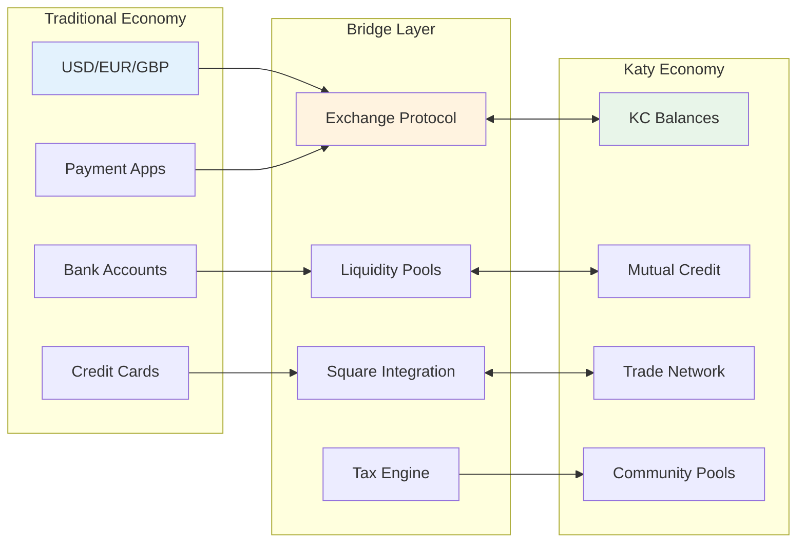
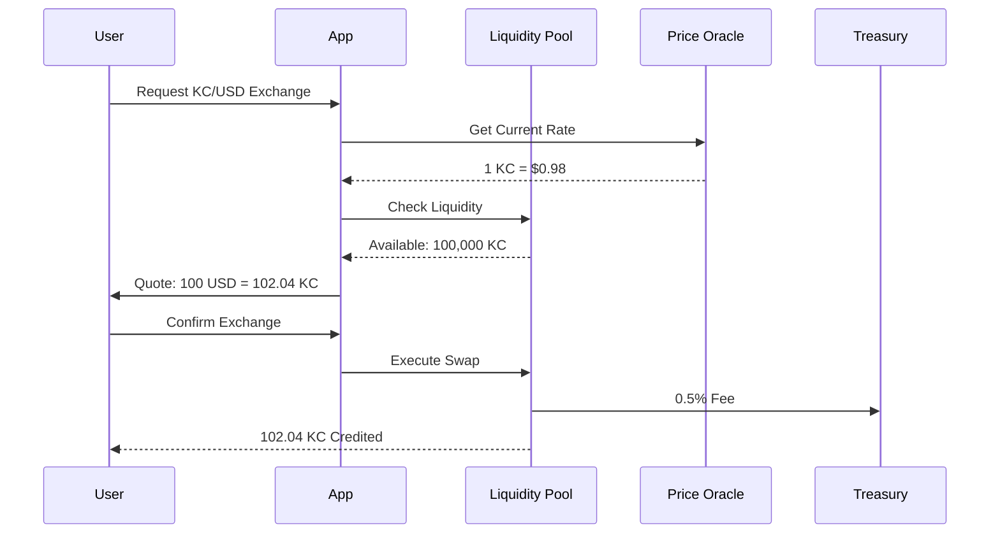
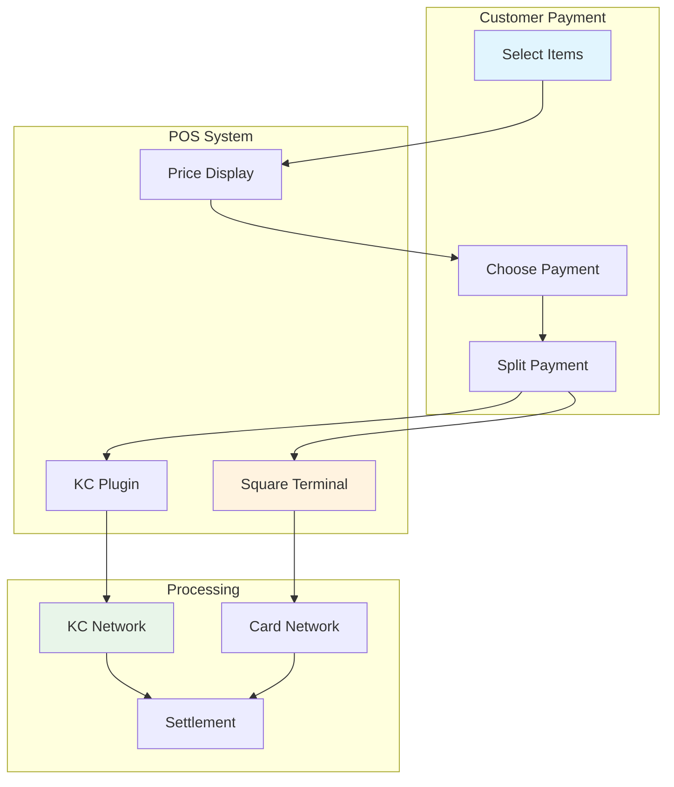
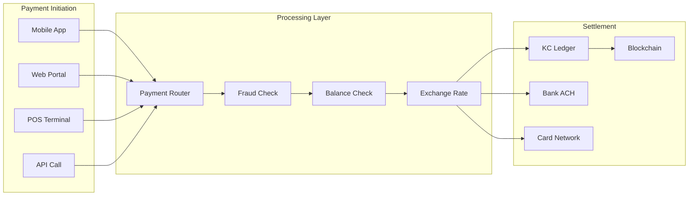
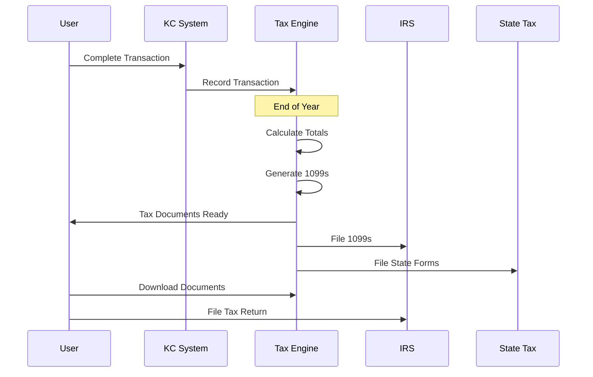
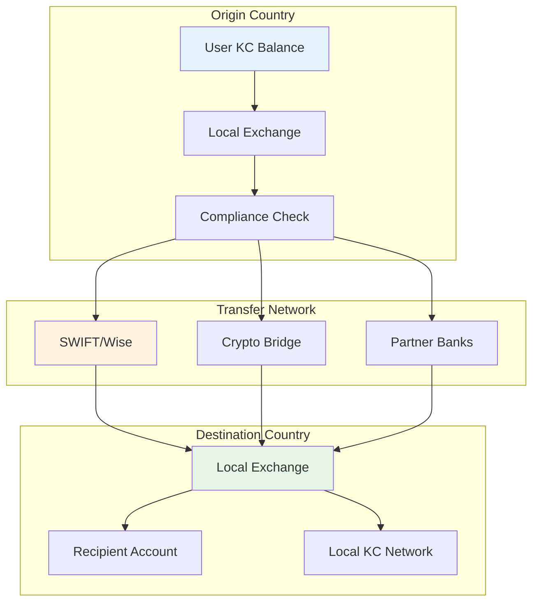
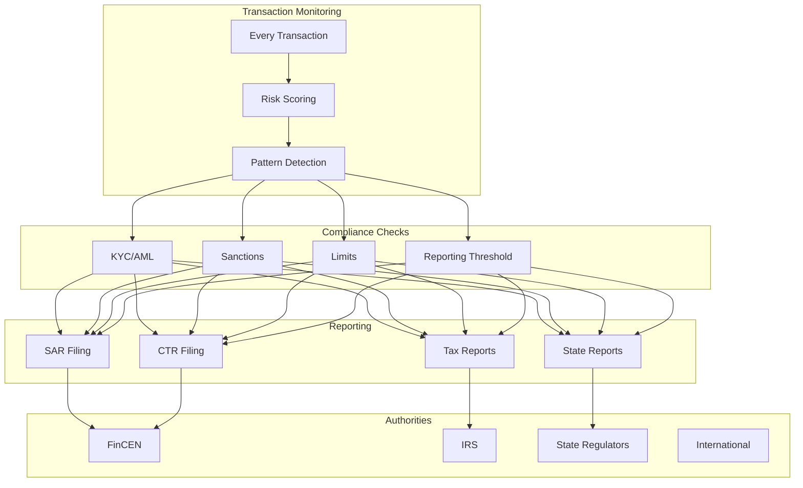

# 💱 Fiat Integration

## Summary

Katy Coin bridges the gap between our new economic system and existing fiat currencies through seamless integration points. This document explains how KC works alongside traditional money, enabling gradual adoption while maintaining compatibility with existing financial infrastructure.

## 📑 Table of Contents

- [Overview](#-overview)
- [Exchange Mechanisms](#-exchange-mechanisms)
- [Business Integration](#-business-integration)
- [Payment Processing](#-payment-processing)
- [Tax Compliance](#-tax-compliance)
- [Banking Bridges](#-banking-bridges)
- [International Transfers](#-international-transfers)
- [Regulatory Framework](#-regulatory-framework)
- [Transition Strategy](#-transition-strategy)

## 🌍 Overview



### Core Principles

```javascript
const fiatIntegration = {
  principles: {
    optionalAdoption: "Use KC, fiat, or both - user choice",
    gradualTransition: "No forced conversion, organic growth",
    taxCompliance: "Full reporting for legal requirements",
    businessFriendly: "Zero friction for merchants"
  },
  
  exchangeRates: {
    initial: "1 KC = $1 USD",
    mechanism: "Community-managed liquidity pools",
    stability: "AI-powered arbitrage prevention",
    transparency: "All rates public on blockchain"
  },
  
  hybridPayments: {
    example: "$50 purchase = 30 KC + $20 USD",
    benefits: "Maximize KC use while covering taxes",
    automatic: "System optimizes payment split"
  }
};
```

## 💸 Exchange Mechanisms

### Liquidity Pool Architecture



### Exchange Implementation

```javascript
class LiquidityPool {
  constructor() {
    this.reserves = {
      KC: 1_000_000,
      USD: 1_000_000
    };
    this.k = this.reserves.KC * this.reserves.USD; // Constant product
  }
  
  async swap(inputAmount, inputCurrency) {
    const outputCurrency = inputCurrency === 'KC' ? 'USD' : 'KC';
    
    // Calculate output using x*y=k formula
    const inputReserve = this.reserves[inputCurrency];
    const outputReserve = this.reserves[outputCurrency];
    
    const inputWithFee = inputAmount * 0.995; // 0.5% fee
    const outputAmount = outputReserve * inputWithFee / 
                         (inputReserve + inputWithFee);
    
    // Update reserves
    this.reserves[inputCurrency] += inputAmount;
    this.reserves[outputCurrency] -= outputAmount;
    
    // Verify k remains constant (with fees)
    assert(this.reserves.KC * this.reserves.USD >= this.k);
    
    return {
      output: outputAmount,
      rate: outputAmount / inputAmount,
      impact: this.calculatePriceImpact(inputAmount)
    };
  }
  
  async addLiquidity(kcAmount, usdAmount) {
    // Mint LP tokens proportional to pool share
    const share = Math.min(
      kcAmount / this.reserves.KC,
      usdAmount / this.reserves.USD
    );
    
    const lpTokens = share * this.totalSupply;
    
    this.reserves.KC += kcAmount;
    this.reserves.USD += usdAmount;
    
    return lpTokens;
  }
}
```

### Community Banking

```javascript
class CommunityBank {
  constructor() {
    this.vaults = new Map(); // Community-managed reserves
    this.lending = new LendingProtocol();
    this.insurance = new InsuranceFund();
  }
  
  async createVault(community) {
    const vault = {
      id: crypto.randomUUID(),
      community,
      reserves: {
        KC: 0,
        USD: 0,
        assets: []
      },
      members: [],
      governance: new DAO(community),
      created: Date.now()
    };
    
    this.vaults.set(vault.id, vault);
    
    // Initial funding from community pool
    await this.fundVault(vault.id, community.initialReserves);
    
    return vault;
  }
  
  async provideLoan(vaultId, member, amount, collateral) {
    const vault = this.vaults.get(vaultId);
    
    // Check member standing
    const creditScore = await this.getCreditScore(member);
    
    // Calculate terms
    const terms = {
      amount,
      interest: this.calculateInterest(creditScore, amount),
      duration: 30 * 24 * 60 * 60 * 1000, // 30 days
      collateral: collateral || amount * 1.5 // 150% collateralization
    };
    
    // Create loan
    if (await vault.governance.approve(terms)) {
      return this.lending.createLoan(terms);
    }
  }
}
```

## 🏪 Business Integration

### Point of Sale Integration



### Square Integration Code

```javascript
class SquareIntegration {
  constructor(squareClient, kcNetwork) {
    this.square = squareClient;
    this.kc = kcNetwork;
  }
  
  async processHybridPayment(order) {
    // Calculate optimal payment split
    const split = this.calculateOptimalSplit(order);
    
    // Display to customer
    const display = {
      total: order.total,
      kcPortion: split.kc,
      usdPortion: split.usd,
      savings: split.savings,
      message: `Pay ${split.kc} KC + $${split.usd}`
    };
    
    // Process KC payment
    const kcPayment = await this.kc.charge({
      amount: split.kc,
      customer: order.customerId,
      merchant: order.merchantId,
      items: order.items
    });
    
    // Process USD payment if needed
    let usdPayment = null;
    if (split.usd > 0) {
      usdPayment = await this.square.payments.create({
        amount: split.usd * 100, // Convert to cents
        currency: 'USD',
        source_id: order.cardToken
      });
    }
    
    // Combine receipts
    return this.generateReceipt({
      kc: kcPayment,
      usd: usdPayment,
      order,
      split
    });
  }
  
  calculateOptimalSplit(order) {
    // Maximize KC usage while ensuring tax coverage
    const taxAmount = order.total * 0.08; // 8% sales tax
    const kcAvailable = this.kc.getBalance(order.customerId);
    
    // Always pay tax in USD for compliance
    const maxKC = Math.min(
      kcAvailable,
      order.total - taxAmount
    );
    
    return {
      kc: maxKC,
      usd: order.total - maxKC,
      savings: maxKC * 0.01, // 1% rewards on KC usage
      taxPortion: taxAmount
    };
  }
}
```

### Merchant Dashboard

```javascript
class MerchantDashboard {
  async generateReport(merchantId, period) {
    const transactions = await this.getTransactions(merchantId, period);
    
    return {
      revenue: {
        total: this.sumTotal(transactions),
        kc: this.sumKC(transactions),
        usd: this.sumUSD(transactions),
        ratio: this.sumKC(transactions) / this.sumTotal(transactions)
      },
      
      customers: {
        total: new Set(transactions.map(t => t.customerId)).size,
        kcUsers: transactions.filter(t => t.kcAmount > 0).length,
        adoption: this.calculateAdoptionRate(transactions)
      },
      
      tax: {
        collected: this.sumTax(transactions),
        reportable: this.generateTaxReport(transactions),
        form1099k: this.generate1099K(transactions)
      },
      
      liquidity: {
        kcBalance: await this.kc.getBalance(merchantId),
        pendingSettlement: await this.getPendingSettlement(merchantId),
        exchangeOptions: await this.getExchangeOptions(merchantId)
      }
    };
  }
}
```

## 💳 Payment Processing

### Payment Flow Architecture



### Payment Processing Implementation

```javascript
class PaymentProcessor {
  async processPayment(payment) {
    // Validate payment
    const validation = await this.validate(payment);
    if (!validation.success) {
      throw new PaymentError(validation.error);
    }
    
    // Run fraud checks
    const fraudScore = await this.fraudDetection.analyze(payment);
    if (fraudScore > 0.7) {
      await this.flagForReview(payment);
      throw new FraudError('Payment flagged for review');
    }
    
    // Check balances
    const balances = await this.checkBalances(payment);
    
    // Determine payment method
    const method = this.determineMethod(payment, balances);
    
    // Process based on method
    switch(method) {
      case 'KC_ONLY':
        return this.processKCPayment(payment);
        
      case 'USD_ONLY':
        return this.processUSDPayment(payment);
        
      case 'HYBRID':
        return this.processHybridPayment(payment);
        
      case 'MULTI_PARTY':
        return this.processMultiPartyTrade(payment);
    }
  }
  
  async processKCPayment(payment) {
    // Execute KC transfer
    const transaction = await this.kc.transfer({
      from: payment.from,
      to: payment.to,
      amount: payment.amount,
      memo: payment.memo
    });
    
    // Update merchant instant settlement
    if (payment.instantSettle) {
      await this.instantSettle(payment.to, payment.amount);
    }
    
    // Queue for batch settlement
    await this.settlementQueue.add(transaction);
    
    return {
      id: transaction.id,
      status: 'completed',
      method: 'KC',
      amount: payment.amount,
      fee: payment.amount * 0.001, // 0.1% fee
      settlement: 'pending'
    };
  }
}
```

## 📊 Tax Compliance

### Tax Reporting System

```javascript
class TaxCompliance {
  constructor() {
    this.reportingThresholds = {
      form1099k: 600, // $600 USD equivalent
      form1099misc: 10, // $10 USD equivalent
      w9Required: 200 // Backup withholding threshold
    };
  }
  
  async generateTaxDocuments(userId, year) {
    const activity = await this.getUserActivity(userId, year);
    
    const documents = [];
    
    // Calculate KC to USD conversions
    const conversions = activity.exchanges.reduce((sum, ex) => {
      return sum + (ex.type === 'KC_TO_USD' ? ex.usdAmount : 0);
    }, 0);
    
    // Calculate goods/services income
    const income = activity.trades.reduce((sum, trade) => {
      return sum + this.calculateFairMarketValue(trade);
    }, 0);
    
    // Generate 1099-K if threshold met
    if (conversions >= this.reportingThresholds.form1099k) {
      documents.push(await this.generate1099K({
        userId,
        year,
        grossAmount: conversions,
        transactionCount: activity.exchanges.length
      }));
    }
    
    // Generate 1099-MISC for barter income
    if (income >= this.reportingThresholds.form1099misc) {
      documents.push(await this.generate1099MISC({
        userId,
        year,
        barterIncome: income,
        trades: activity.trades
      }));
    }
    
    // Generate detailed transaction report
    documents.push(await this.generateDetailedReport(activity));
    
    return documents;
  }
  
  calculateFairMarketValue(trade) {
    // IRS requires FMV for barter transactions
    return trade.items.reduce((sum, item) => {
      const fmv = this.pricingOracle.getFMV(item, trade.date);
      return sum + fmv;
    }, 0);
  }
  
  async handleBackupWithholding(payment) {
    // Check if W-9 on file
    const hasW9 = await this.hasValidW9(payment.recipient);
    
    if (!hasW9 && payment.amount >= this.reportingThresholds.w9Required) {
      // Apply 24% backup withholding
      const withholding = payment.amount * 0.24;
      
      await this.withholdTax({
        payment,
        amount: withholding,
        reason: 'BACKUP_WITHHOLDING'
      });
      
      return payment.amount - withholding;
    }
    
    return payment.amount;
  }
}
```

### Tax Integration Flow



## 🏦 Banking Bridges

### ACH Integration

```javascript
class BankingBridge {
  constructor() {
    this.plaid = new PlaidClient(process.env.PLAID_SECRET);
    this.dwolla = new DwollaClient(process.env.DWOLLA_KEY);
  }
  
  async linkBankAccount(userId) {
    // Create Plaid link token
    const linkToken = await this.plaid.linkTokenCreate({
      user: { client_user_id: userId },
      products: ['auth', 'transactions'],
      country_codes: ['US'],
      language: 'en'
    });
    
    // User completes Plaid Link flow
    // Returns public_token
    
    return linkToken;
  }
  
  async exchangeToken(publicToken) {
    // Exchange for access token
    const response = await this.plaid.itemPublicTokenExchange({
      public_token: publicToken
    });
    
    // Get account details
    const accounts = await this.plaid.accountsGet({
      access_token: response.access_token
    });
    
    // Create funding source in Dwolla
    const fundingSource = await this.dwolla.createFundingSource({
      routingNumber: accounts.numbers.ach.routing,
      accountNumber: accounts.numbers.ach.account,
      type: accounts.accounts[0].subtype,
      name: accounts.accounts[0].name
    });
    
    return fundingSource;
  }
  
  async transferToBank(userId, amount) {
    const fundingSource = await this.getFundingSource(userId);
    
    // Create transfer
    const transfer = await this.dwolla.transfers.create({
      _links: {
        source: { href: this.kcMasterAccount },
        destination: { href: fundingSource.location }
      },
      amount: {
        currency: 'USD',
        value: amount.toString()
      },
      metadata: {
        userId,
        type: 'KC_TO_BANK',
        timestamp: Date.now()
      }
    });
    
    // Update KC balance
    await this.kc.debit(userId, amount);
    
    return transfer;
  }
}
```

### Wire Transfer Support

```javascript
class InternationalBridge {
  constructor() {
    this.wise = new WiseAPI(process.env.WISE_API_KEY);
    this.currencyCloud = new CurrencyCloudClient();
  }
  
  async createInternationalTransfer(params) {
    const {
      fromCurrency,
      toCurrency,
      amount,
      recipient
    } = params;
    
    // Get exchange rate
    const quote = await this.wise.createQuote({
      source: fromCurrency,
      target: toCurrency,
      sourceAmount: amount
    });
    
    // Create recipient
    const recipientId = await this.wise.createRecipient({
      currency: toCurrency,
      type: recipient.type,
      details: recipient.details
    });
    
    // Create transfer
    const transfer = await this.wise.createTransfer({
      targetAccount: recipientId,
      quote: quote.id,
      reference: `KC-${Date.now()}`
    });
    
    // Fund transfer from KC reserves
    await this.fundTransfer(transfer.id, amount);
    
    return {
      id: transfer.id,
      amount: quote.targetAmount,
      fee: quote.fee,
      rate: quote.rate,
      delivery: quote.deliveryEstimate
    };
  }
}
```

## 🌐 International Transfers

### Cross-Border Payment Flow



### Multi-Currency Support

```javascript
class MultiCurrencyEngine {
  constructor() {
    this.supportedCurrencies = [
      'USD', 'EUR', 'GBP', 'JPY', 'CNY', 
      'INR', 'BRL', 'MXN', 'CAD', 'AUD'
    ];
    
    this.exchangeRates = new Map();
    this.corridors = new Map(); // Optimized payment corridors
  }
  
  async getExchangeRate(from, to) {
    if (from === 'KC') {
      // KC to any currency
      const kcToUSD = await this.getKCRate();
      const usdToTarget = await this.getForexRate('USD', to);
      return kcToUSD * usdToTarget;
    }
    
    if (to === 'KC') {
      // Any currency to KC
      const sourceToUSD = await this.getForexRate(from, 'USD');
      const usdToKC = 1 / await this.getKCRate();
      return sourceToUSD * usdToKC;
    }
    
    // Direct forex
    return this.getForexRate(from, to);
  }
  
  async optimizeTransferRoute(from, to, amount) {
    const routes = [];
    
    // Direct route
    routes.push({
      path: [from, to],
      cost: await this.calculateDirectCost(from, to, amount),
      time: await this.estimateDirectTime(from, to)
    });
    
    // Via USD
    routes.push({
      path: [from, 'USD', to],
      cost: await this.calculateViaCost(from, 'USD', to, amount),
      time: await this.estimateViaTime(from, 'USD', to)
    });
    
    // Via KC
    if (this.hasKCCorridor(from) && this.hasKCCorridor(to)) {
      routes.push({
        path: [from, 'KC', to],
        cost: await this.calculateViaCost(from, 'KC', to, amount),
        time: await this.estimateViaTime(from, 'KC', to)
      });
    }
    
    // Return optimal route
    return routes.sort((a, b) => {
      // Prioritize cost, then time
      const costDiff = a.cost - b.cost;
      if (Math.abs(costDiff) > 0.01) return costDiff;
      return a.time - b.time;
    })[0];
  }
}
```

## 📜 Regulatory Framework

### Compliance Architecture

```javascript
class RegulatoryCompliance {
  constructor() {
    this.jurisdictions = new Map();
    this.licenses = new Map();
    this.reporting = new ReportingEngine();
  }
  
  async checkCompliance(transaction) {
    const checks = {
      aml: await this.checkAML(transaction),
      kyc: await this.checkKYC(transaction),
      sanctions: await this.checkSanctions(transaction),
      limits: await this.checkLimits(transaction),
      reporting: await this.checkReporting(transaction)
    };
    
    const failures = Object.entries(checks)
      .filter(([_, result]) => !result.passed)
      .map(([check, result]) => ({ check, reason: result.reason }));
    
    if (failures.length > 0) {
      await this.handleComplianceFailure(transaction, failures);
      return { compliant: false, failures };
    }
    
    return { compliant: true };
  }
  
  async checkAML(transaction) {
    // Anti-money laundering checks
    const riskScore = await this.amlEngine.score(transaction);
    
    if (riskScore > 0.8) {
      return {
        passed: false,
        reason: 'High AML risk',
        score: riskScore
      };
    }
    
    // Check for structuring
    const pattern = await this.detectStructuring(transaction);
    if (pattern.detected) {
      return {
        passed: false,
        reason: 'Potential structuring detected',
        pattern
      };
    }
    
    return { passed: true };
  }
  
  async registerMSB() {
    // Register as Money Service Business
    const registration = {
      fincen: await this.registerWithFinCEN(),
      states: await this.registerStateByState(),
      licenses: await this.obtainRequiredLicenses()
    };
    
    return registration;
  }
}
```

### Regulatory Reporting



## 🔄 Transition Strategy

### Adoption Phases

```javascript
const adoptionStrategy = {
  phase1: {
    name: "Early Adopters",
    duration: "Months 1-3",
    features: [
      "Basic KC/USD exchange",
      "Simple payment splitting",
      "Manual tax reporting"
    ],
    incentives: [
      "0% exchange fees",
      "5% bonus on first exchange",
      "Early adopter NFT"
    ]
  },
  
  phase2: {
    name: "Business Integration",
    duration: "Months 4-6",
    features: [
      "Square POS plugin",
      "Automated tax docs",
      "Merchant dashboards",
      "Bulk exchanges"
    ],
    incentives: [
      "0.5% merchant fees (vs 2.9% cards)",
      "Instant settlement",
      "Free accounting integration"
    ]
  },
  
  phase3: {
    name: "Mainstream Adoption",
    duration: "Months 7-12",
    features: [
      "Bank account linking",
      "Bill pay in KC",
      "Payroll integration",
      "Investment options"
    ],
    incentives: [
      "Cashback rewards",
      "Referral bonuses",
      "Community governance tokens"
    ]
  },
  
  phase4: {
    name: "Full Integration",
    duration: "Year 2+",
    features: [
      "Government payment acceptance",
      "Mortgage/loan payments",
      "International corridors",
      "DeFi integration"
    ],
    vision: [
      "KC as primary currency",
      "Fiat as bridge only",
      "Community-owned infrastructure"
    ]
  }
};
```

### Migration Incentives

```javascript
class MigrationIncentives {
  async calculateIncentive(user) {
    const incentives = [];
    
    // Early adopter bonus
    if (user.joinDate < this.earlyAdopterCutoff) {
      incentives.push({
        type: 'EARLY_ADOPTER',
        amount: 100, // 100 KC bonus
        nft: 'Genesis Member'
      });
    }
    
    // Volume-based rewards
    const monthlyVolume = await this.getMonthlyVolume(user.id);
    if (monthlyVolume > 1000) {
      incentives.push({
        type: 'VOLUME_REWARD',
        amount: monthlyVolume * 0.01, // 1% cashback
        tier: this.getVolumeTier(monthlyVolume)
      });
    }
    
    // Referral bonuses
    const referrals = await this.getReferrals(user.id);
    incentives.push({
      type: 'REFERRAL',
      amount: referrals.length * 25, // 25 KC per referral
      multiplier: Math.min(referrals.length / 10, 2) // Up to 2x multiplier
    });
    
    // Merchant incentives
    if (user.type === 'MERCHANT') {
      incentives.push({
        type: 'MERCHANT_ADOPTION',
        feeDiscount: 0.5, // 50% off fees
        instantSettlement: true,
        creditLine: this.calculateCreditLine(user)
      });
    }
    
    return incentives;
  }
}
```

### Success Metrics

```javascript
const successMetrics = {
  adoption: {
    users: {
      month3: 10_000,
      month6: 100_000,
      year1: 1_000_000
    },
    merchants: {
      month3: 100,
      month6: 1_000,
      year1: 10_000
    },
    transactions: {
      daily: "10,000 by month 6",
      value: "$1M daily by year 1"
    }
  },
  
  financial: {
    totalValueLocked: "$10M by year 1",
    exchangeVolume: "$100M annually",
    merchantSavings: "$1M in reduced fees"
  },
  
  ecosystem: {
    liquidityDepth: "$1M+ in pools",
    p2pTrades: "50% of volume",
    communityProjects: "100 funded"
  }
};
```

## 📚 Related Documentation

- **[Technical Architecture](ARCHITECTURE.md)** - Complete system design
- **[Why This Works](WHY-IT-WORKS.md)** - Economic principles
- **[Phase 2: Intelligence](phases/PHASE-2-INTELLIGENCE.md)** - AI-powered features
- **[Phase 4: Scale](phases/PHASE-4-SCALE.md)** - International expansion

---

**[← Back to Docs](README.md)** | **[Next: Why This Works →](WHY-IT-WORKS.md)**