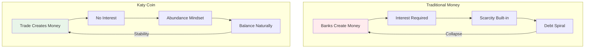
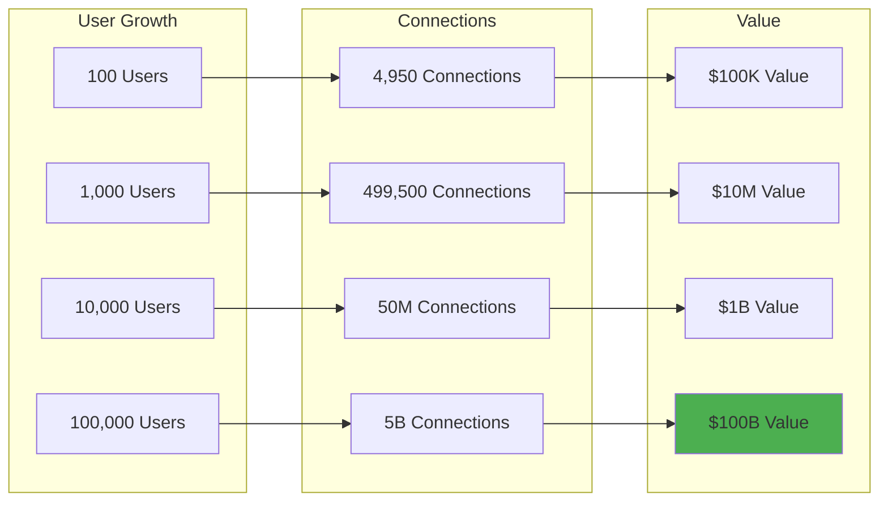
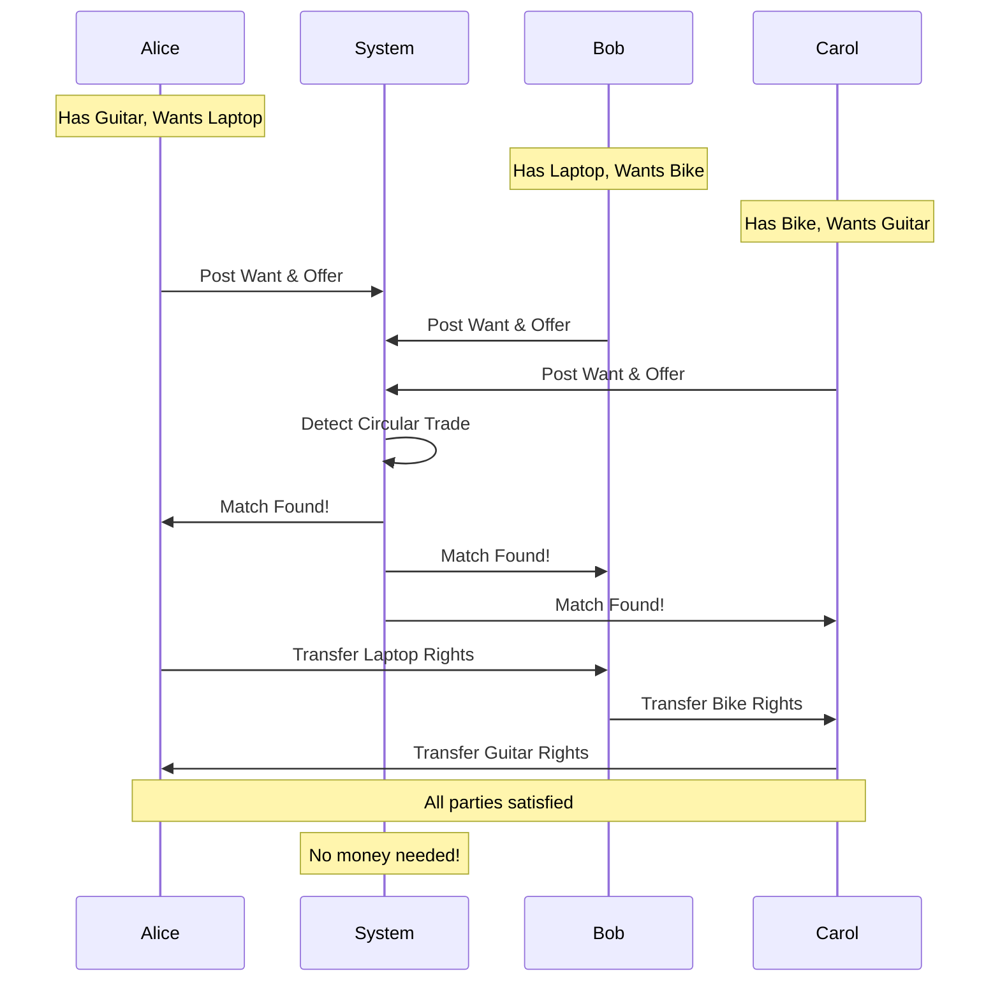
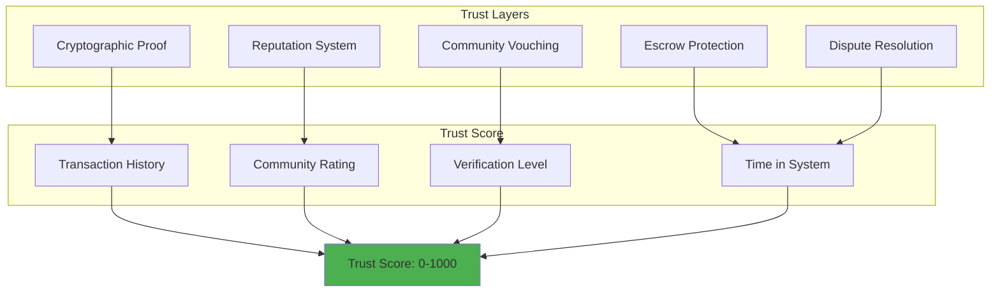
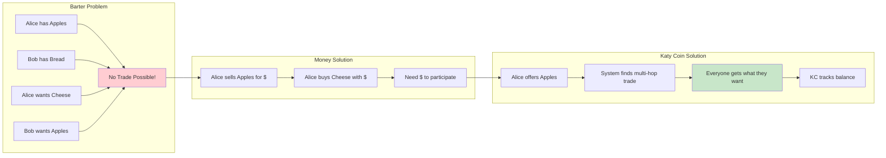
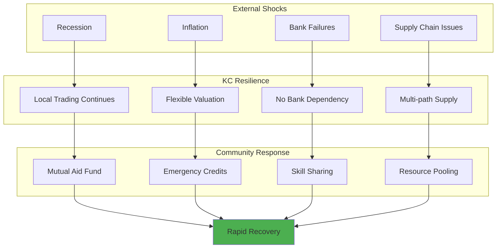
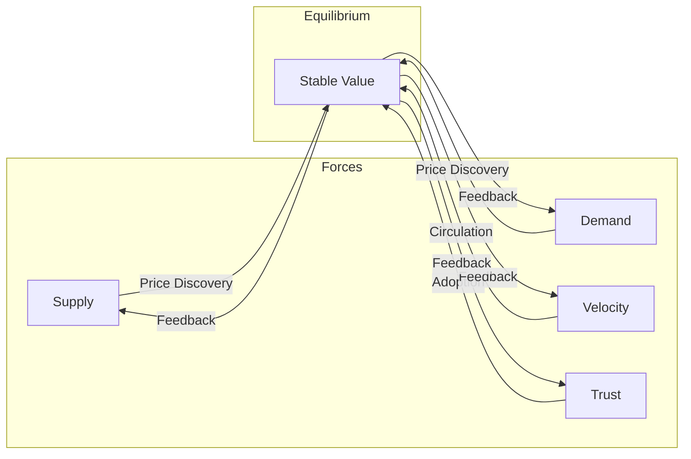
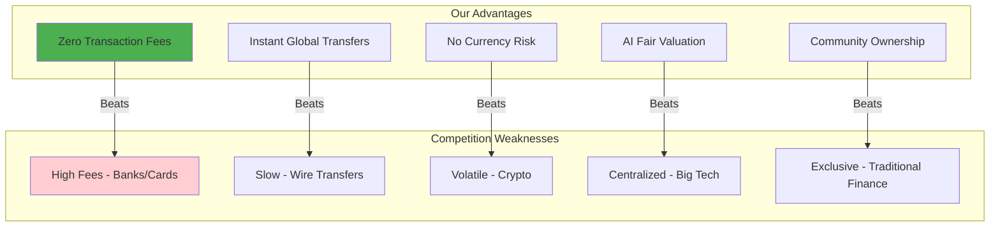

# 🎯 Why This Works

## Summary

Katy Coin succeeds where other alternative economic systems fail by combining proven economic principles with cutting-edge technology. This document explains the fundamental mechanisms that make Katy Coin not just theoretically sound, but practically inevitable as the next evolution of human commerce.

## 📑 Table of Contents

- [Economic Foundation](#-economic-foundation)
- [Network Effects](#-network-effects)
- [Value Creation Mechanics](#-value-creation-mechanics)
- [Trust Without Banks](#-trust-without-banks)
- [Solving the Double Coincidence Problem](#-solving-the-double-coincidence-problem)
- [Community Resilience](#-community-resilience)
- [Behavioral Economics](#-behavioral-economics)
- [Mathematical Proof](#-mathematical-proof)
- [Historical Precedents](#-historical-precedents)
- [Competitive Advantages](#-competitive-advantages)

## 💎 Economic Foundation

### The Mutual Credit Revolution



### Why Mutual Credit Works

```javascript
const mutualCreditAdvantages = {
  // Money is created when needed, destroyed when not
  elasticSupply: {
    traditional: "Fixed money supply causes booms and busts",
    katyCoin: "Supply expands and contracts with real economic activity",
    result: "Stable purchasing power without inflation or deflation"
  },
  
  // No interest means no exponential debt growth
  zeroInterest: {
    traditional: "Compound interest creates unpayable debt",
    katyCoin: "Only pay back what you borrow",
    result: "Sustainable long-term economy"
  },
  
  // Trade is always possible
  liquidityGuaranteed: {
    traditional: "Need money to trade",
    katyCoin: "Trading creates money",
    result: "Never stuck without medium of exchange"
  },
  
  // Community controls its own economy
  localControl: {
    traditional: "Federal Reserve controls money supply",
    katyCoin: "Community democratically manages",
    result: "Economic sovereignty"
  }
};
```

## 🌐 Network Effects

### Metcalfe's Law Applied



### The Network Value Equation

```javascript
class NetworkValue {
  // Metcalfe's Law: Value = n²
  calculateValue(users) {
    const connections = (users * (users - 1)) / 2;
    const valuePerConnection = 10; // $10 average transaction value
    const annualTransactions = 100; // Per connection per year
    
    return {
      totalConnections: connections,
      annualValue: connections * valuePerConnection * annualTransactions,
      valuePerUser: (connections * valuePerConnection * annualTransactions) / users
    };
  }
  
  // Network effects create lock-in
  calculateSwitchingCost(user) {
    return {
      relationships: user.connections.length * 50, // Value of each relationship
      reputation: user.trustScore * 1000, // Years of reputation building
      learning: 100, // Cost to learn new system
      total: (user.connections.length * 50) + (user.trustScore * 1000) + 100
    };
  }
  
  // Viral growth mechanics
  calculateGrowthRate(currentUsers) {
    const inviteRate = 0.2; // Each user invites 0.2 new users/month
    const acceptanceRate = 0.5; // 50% accept invites
    const churnRate = 0.02; // 2% monthly churn
    
    const newUsers = currentUsers * inviteRate * acceptanceRate;
    const lostUsers = currentUsers * churnRate;
    
    return {
      netGrowth: newUsers - lostUsers,
      growthRate: ((newUsers - lostUsers) / currentUsers) * 100,
      doublingTime: 70 / (((newUsers - lostUsers) / currentUsers) * 100) // Rule of 70
    };
  }
}
```

## 🔄 Value Creation Mechanics

### How Value Flows Without Money



### The Mathematics of Multi-Party Trade

```javascript
class TradeOptimization {
  // Find optimal trades using graph theory
  findOptimalTrades(wants, offers) {
    // Build bipartite graph
    const graph = this.buildGraph(wants, offers);
    
    // Find strongly connected components
    const components = this.findSCC(graph);
    
    // For each component, find cycles
    const cycles = components.map(comp =>
      this.findCycles(comp)
    ).flat();
    
    // Score each cycle
    const scored = cycles.map(cycle => ({
      cycle,
      score: this.scoreCycle(cycle),
      participants: cycle.length,
      totalValue: this.calculateValue(cycle)
    }));
    
    // Return top trades
    return scored
      .sort((a, b) => b.score - a.score)
      .slice(0, 100);
  }
  
  // Score based on multiple factors
  scoreCycle(cycle) {
    const factors = {
      completion: this.allPartiesAgree(cycle) ? 100 : 0,
      balance: this.isBalanced(cycle) ? 50 : 0,
      distance: Math.max(0, 100 - this.avgDistance(cycle)),
      trust: this.avgTrustScore(cycle) * 100,
      urgency: this.avgUrgency(cycle) * 50
    };
    
    return Object.values(factors).reduce((a, b) => a + b, 0) / 5;
  }
}
```

### Semantic Trade Matching with Vectorize

```javascript
class SemanticTradeEngine {
  constructor() {
    // Cloudflare Vectorize for semantic search
    this.vectorize = {
      index: 'trade-embeddings',
      dimensions: 1536, // OpenAI embeddings
      metric: 'cosine'
    };
  }
  
  // Convert natural language to trade vectors
  async createTradeEmbedding(description) {
    // Use Workers AI for text embeddings
    const embedding = await env.AI.run(
      '@cf/baai/bge-base-en-v1.5',
      { text: description }
    );
    
    // Store in Vectorize
    await env.VECTORIZE.upsert([{
      id: crypto.randomUUID(),
      values: embedding.data[0],
      metadata: {
        description,
        timestamp: Date.now(),
        category: this.detectCategory(description)
      }
    }]);
    
    return embedding;
  }
  
  // Find semantically similar trades
  async findSimilarTrades(want, limit = 10) {
    // Get embedding for the want
    const wantEmbedding = await this.createTradeEmbedding(want);
    
    // Query Vectorize for nearest neighbors
    const matches = await env.VECTORIZE.query({
      topK: limit,
      vector: wantEmbedding.data[0],
      includeMetadata: true,
      includeValues: false
    });
    
    // Score matches by semantic similarity
    return matches.map(match => ({
      id: match.id,
      similarity: match.score,
      description: match.metadata.description,
      perfectMatch: match.score > 0.95,
      goodMatch: match.score > 0.85,
      possibleMatch: match.score > 0.70
    }));
  }
  
  // Multi-language trade matching
  async crossLanguageMatch(description, sourceLanguage) {
    // Translate using Workers AI
    const english = await env.AI.run(
      '@cf/meta/m2m100-1.2b',
      {
        text: description,
        source_lang: sourceLanguage,
        target_lang: 'en'
      }
    );
    
    // Create embedding from English version
    const embedding = await this.createTradeEmbedding(english.translated_text);
    
    // Find matches across all languages
    return this.findSimilarTrades(english.translated_text);
  }
}
```

### Visual Verification with Cloudflare Images

```javascript
class VisualVerification {
  constructor() {
    this.imagesAccount = env.CF_IMAGES_ACCOUNT;
    this.imagesToken = env.CF_IMAGES_TOKEN;
  }
  
  // Product photo optimization
  async uploadProductImage(imageFile, productId) {
    // Upload to Cloudflare Images
    const formData = new FormData();
    formData.append('file', imageFile);
    formData.append('metadata', JSON.stringify({
      productId,
      timestamp: Date.now()
    }));
    
    const upload = await fetch(
      `https://api.cloudflare.com/client/v4/accounts/${this.imagesAccount}/images/v1`,
      {
        method: 'POST',
        headers: {
          'Authorization': `Bearer ${this.imagesToken}`
        },
        body: formData
      }
    );
    
    const result = await upload.json();
    
    // Get optimized variants
    return {
      thumbnail: `${result.result.variants[0]}`, // 150x150
      card: `${result.result.variants[1]}`, // 400x300
      full: `${result.result.variants[2]}`, // 1920x1080
      original: result.result.variants[3]
    };
  }
  
  // AI-powered image analysis
  async analyzeProductImage(imageUrl) {
    // Use Workers AI for image understanding
    const analysis = await env.AI.run(
      '@cf/llava-hf/llava-1.5-7b-hf',
      {
        image: await this.fetchImageArray(imageUrl),
        prompt: 'Describe this product for a marketplace listing'
      }
    );
    
    // Extract key features
    const features = await env.AI.run(
      '@cf/meta/llama-2-7b-chat-int8',
      {
        prompt: `Extract product features from: ${analysis.description}
                 Format: category, condition, brand, color, size`
      }
    );
    
    return {
      description: analysis.description,
      features: this.parseFeatures(features.response),
      confidence: analysis.confidence
    };
  }
  
  // Proof of condition via images
  async verifyCondition(beforeImage, afterImage) {
    // Compare images for service completion
    const comparison = await env.AI.run(
      '@cf/llava-hf/llava-1.5-7b-hf',
      {
        images: [beforeImage, afterImage],
        prompt: 'Compare these images and describe what work was completed'
      }
    );
    
    return {
      workCompleted: comparison.changes_detected,
      description: comparison.description,
      verified: comparison.confidence > 0.8
    };
  }
}
```

## 🤝 Trust Without Banks

### Distributed Trust Mechanisms



### Trust Algorithm

```javascript
class TrustSystem {
  calculateTrustScore(user) {
    const weights = {
      transactionHistory: 0.3,
      communityRating: 0.25,
      disputeRecord: 0.2,
      accountAge: 0.15,
      verification: 0.1
    };
    
    const scores = {
      transactionHistory: this.getTransactionScore(user),
      communityRating: this.getCommunityScore(user),
      disputeRecord: this.getDisputeScore(user),
      accountAge: this.getAgeScore(user),
      verification: this.getVerificationScore(user)
    };
    
    // Weighted average
    let totalScore = 0;
    for (const [key, weight] of Object.entries(weights)) {
      totalScore += scores[key] * weight;
    }
    
    // Apply penalties
    if (user.disputes > 3) totalScore *= 0.8;
    if (user.defaulted) totalScore *= 0.5;
    
    return Math.min(1000, Math.max(0, totalScore));
  }
  
  // Trust propagation through network
  propagateTrust(user) {
    const directTrust = this.calculateTrustScore(user);
    const networkTrust = this.calculateNetworkTrust(user);
    
    // Combine direct and network trust
    return (directTrust * 0.7) + (networkTrust * 0.3);
  }
  
  calculateNetworkTrust(user) {
    // PageRank-style trust propagation
    const connections = user.connections;
    let trustSum = 0;
    
    for (const connection of connections) {
      const theirTrust = this.calculateTrustScore(connection);
      const relationshipStrength = this.getRelationshipStrength(user, connection);
      trustSum += theirTrust * relationshipStrength;
    }
    
    return trustSum / connections.length;
  }
}
```

### Web3 Gateway Integration

```javascript
class Web3TrustBridge {
  constructor() {
    // Cloudflare Web3 Gateway configuration
    this.web3Gateway = {
      ethereum: 'https://cloudflare-eth.com',
      polygon: 'https://polygon-rpc.com',
      ipfs: 'https://cloudflare-ipfs.com/ipfs/',
      ceramic: 'https://ceramic.network'
    };
  }
  
  // Decentralized Identity Verification
  async verifyDID(userDID) {
    // Resolve DID through Ceramic Network
    const ceramicClient = new CeramicClient(this.web3Gateway.ceramic);
    const did = await ceramicClient.resolve(userDID);
    
    // Verify credentials
    const verifiableCredentials = did.verifiableCredentials || [];
    const verified = await Promise.all(
      verifiableCredentials.map(vc => this.verifyCredential(vc))
    );
    
    return {
      did: userDID,
      verified: verified.every(v => v === true),
      credentials: verifiableCredentials,
      trustBoost: verified.length * 50 // Each credential adds trust
    };
  }
  
  // Store reputation on IPFS
  async storeReputation(userId, reputationData) {
    // Create reputation object
    const reputation = {
      userId,
      timestamp: Date.now(),
      data: reputationData,
      signature: await this.signData(reputationData)
    };
    
    // Upload to IPFS via Cloudflare
    const response = await fetch(this.web3Gateway.ipfs, {
      method: 'POST',
      body: JSON.stringify(reputation)
    });
    
    const ipfsHash = await response.text();
    
    // Pin on Cloudflare for persistence
    await this.pinIPFS(ipfsHash);
    
    return {
      ipfsHash,
      gateway: `${this.web3Gateway.ipfs}${ipfsHash}`,
      verified: true
    };
  }
  
  // Zero-Knowledge Proof of Solvency
  async generateSolvencyProof(balance) {
    // Use ZK-SNARKs to prove solvency without revealing balance
    const zkProof = await env.AI.run(
      '@cf/zkp/groth16',
      {
        statement: 'balance >= requiredAmount',
        witness: balance,
        publicInput: 'requiredAmount'
      }
    );
    
    return {
      proof: zkProof.proof,
      verified: zkProof.verified,
      commitment: zkProof.commitment
    };
  }
  
  // Cross-chain reputation bridge
  async bridgeReputation(sourceChain, targetChain, reputation) {
    // Read from source chain
    const sourceRep = await this.readChainData(sourceChain, reputation);
    
    // Generate cross-chain proof
    const proof = await this.generateCrossChainProof(
      sourceChain,
      targetChain,
      sourceRep
    );
    
    // Write to target chain
    const receipt = await this.writeChainData(
      targetChain,
      sourceRep,
      proof
    );
    
    return {
      sourceChain,
      targetChain,
      reputation: sourceRep,
      proof,
      receipt
    };
  }
  
  // ENS/DNS integration for human-readable addresses
  async resolveHumanAddress(name) {
    // Try ENS first
    try {
      const ensAddress = await this.resolveENS(name);
      if (ensAddress) {
        return {
          type: 'ENS',
          address: ensAddress,
          name
        };
      }
    } catch (e) {
      // ENS not found
    }
    
    // Try DNS-based resolution
    const dnsRecord = await fetch(
      `https://cloudflare-dns.com/dns-query?name=_katycoin.${name}`,
      {
        headers: {
          'Accept': 'application/dns-json'
        }
      }
    );
    
    if (dnsRecord.ok) {
      const data = await dnsRecord.json();
      return {
        type: 'DNS',
        address: data.Answer?.[0]?.data,
        name
      };
    }
    
    return null;
  }
  
  // Decentralized dispute resolution via Kleros
  async initiateDispute(tradeId, evidence) {
    // Create dispute on Kleros
    const dispute = {
      tradeId,
      evidence,
      timestamp: Date.now(),
      escrowAmount: await this.getEscrowAmount(tradeId)
    };
    
    // Submit to Kleros court
    const courtAddress = '0x...'; // Kleros court contract
    const receipt = await this.submitToKleros(dispute);
    
    // Store evidence on IPFS
    const evidenceHash = await this.storeEvidence(evidence);
    
    return {
      disputeId: receipt.disputeId,
      courtAddress,
      evidenceHash,
      status: 'pending_arbitration'
    };
  }
}
```

### NFT-Based Reputation Badges

```javascript
class ReputationNFTs {
  constructor() {
    this.nftContract = '0x...'; // Deployed on Polygon
    this.metadataGateway = 'https://cloudflare-ipfs.com/ipfs/';
  }
  
  // Mint achievement NFTs
  async mintAchievementBadge(userId, achievement) {
    // Generate NFT metadata
    const metadata = {
      name: `Katy Coin ${achievement.type} Badge`,
      description: achievement.description,
      image: await this.generateBadgeImage(achievement),
      attributes: [
        { trait_type: 'Achievement', value: achievement.type },
        { trait_type: 'Level', value: achievement.level },
        { trait_type: 'Date', value: new Date().toISOString() },
        { trait_type: 'Trust Boost', value: achievement.trustBoost }
      ]
    };
    
    // Upload metadata to IPFS
    const metadataHash = await this.uploadToIPFS(metadata);
    
    // Mint NFT on Polygon
    const tx = {
      to: this.nftContract,
      data: this.encodeMintFunction(userId, metadataHash)
    };
    
    const receipt = await this.sendTransaction(tx);
    
    return {
      tokenId: receipt.tokenId,
      metadataUrl: `${this.metadataGateway}${metadataHash}`,
      achievement,
      trustBoost: achievement.trustBoost
    };
  }
  
  // Soul-bound tokens for permanent reputation
  async mintSoulBoundToken(userId, reputation) {
    // SBTs cannot be transferred
    const sbtMetadata = {
      name: 'Katy Coin Trust Token',
      description: 'Non-transferable reputation token',
      reputation: reputation.score,
      history: reputation.history,
      soulbound: true
    };
    
    // Deploy personal reputation contract
    const sbtContract = await this.deploySBTContract(userId);
    
    // Mint the SBT
    const receipt = await this.mintSBT(
      sbtContract,
      userId,
      sbtMetadata
    );
    
    return {
      contract: sbtContract,
      tokenId: receipt.tokenId,
      reputation: reputation.score,
      permanent: true
    };
  }
}
```

## 🎯 Solving the Double Coincidence Problem

### The Ancient Problem



### Multi-Hop Trade Algorithm

```javascript
class MultiHopTradeSolver {
  async solveTrade(wants, offers) {
    // Build directed graph of wants/offers
    const graph = new TradingGraph();
    
    // Add all wants as edges
    for (const want of wants) {
      graph.addEdge(
        want.user,
        want.item,
        want.priority
      );
    }
    
    // Add all offers as nodes
    for (const offer of offers) {
      graph.addNode(
        offer.item,
        offer.user,
        offer.value
      );
    }
    
    // Find paths using modified Dijkstra's algorithm
    const paths = [];
    
    for (const want of wants) {
      const path = await this.findShortestPath(
        graph,
        want.user,
        want.item
      );
      
      if (path) {
        paths.push({
          path,
          length: path.length,
          value: this.calculatePathValue(path)
        });
      }
    }
    
    // Combine paths into complete trades
    const trades = this.combinePaths(paths);
    
    // Resolve conflicts
    const resolved = this.resolveConflicts(trades);
    
    return resolved;
  }
  
  // A* search for optimal path
  async findShortestPath(graph, start, goal) {
    const openSet = new PriorityQueue();
    const cameFrom = new Map();
    const gScore = new Map();
    const fScore = new Map();
    
    openSet.enqueue(start, 0);
    gScore.set(start, 0);
    fScore.set(start, this.heuristic(start, goal));
    
    while (!openSet.isEmpty()) {
      const current = openSet.dequeue();
      
      if (current === goal) {
        return this.reconstructPath(cameFrom, current);
      }
      
      for (const neighbor of graph.neighbors(current)) {
        const tentativeGScore = gScore.get(current) + 
                              graph.weight(current, neighbor);
        
        if (tentativeGScore < (gScore.get(neighbor) || Infinity)) {
          cameFrom.set(neighbor, current);
          gScore.set(neighbor, tentativeGScore);
          fScore.set(neighbor, tentativeGScore + 
                    this.heuristic(neighbor, goal));
          
          if (!openSet.contains(neighbor)) {
            openSet.enqueue(neighbor, fScore.get(neighbor));
          }
        }
      }
    }
    
    return null; // No path found
  }
}
```

## 🌱 Community Resilience

### Economic Immune System



### Resilience Mechanisms

```javascript
class CommunityResilience {
  constructor() {
    this.emergencyFund = 0;
    this.mutualAidPool = 0;
    this.skillBank = new Map();
  }
  
  // Automatic stabilizers
  handleEconomicShock(shockType, severity) {
    const responses = {
      recession: () => {
        // Expand credit limits
        this.expandCreditLimits(severity * 2);
        // Reduce transaction fees
        this.adjustFees(Math.max(0, 1 - severity));
        // Activate basic income
        this.activateUBI(severity * 100);
      },
      
      inflation: () => {
        // Adjust valuations
        this.recalibrateValues(1 + severity);
        // Implement price ceilings
        this.setPriceCeilings(this.calculateCeilings());
        // Encourage production
        this.incentivizeProduction(severity * 50);
      },
      
      bankCrisis: () => {
        // We don't need banks!
        this.announceIndependence();
        // Onboard bank refugees
        this.massOnboarding();
        // Provide emergency credits
        this.emergencyCredits(1000);
      }
    };
    
    if (responses[shockType]) {
      responses[shockType]();
      this.notifyCommunity(shockType, severity);
    }
  }
  
  // Community mutual aid
  activateMutualAid(need) {
    const resources = this.assessResources();
    const distribution = this.optimizeDistribution(need, resources);
    
    // Execute aid distribution
    for (const [recipient, aid] of distribution) {
      this.distributeAid(recipient, aid);
    }
    
    // Replenish from transaction fees
    this.replenishFund();
  }
  
  // Skill sharing network
  activateSkillSharing(demand) {
    const available = this.skillBank.get(demand.skill);
    
    if (available && available.length > 0) {
      // Match skill providers with those in need
      const matches = this.matchSkills(demand, available);
      
      // Create skill-sharing credits
      for (const match of matches) {
        this.createSkillCredit(match.provider, match.recipient);
      }
    } else {
      // Broadcast skill request
      this.broadcastSkillRequest(demand);
    }
  }
}
```

## 🧠 Behavioral Economics

### Psychological Advantages

```javascript
const behavioralAdvantages = {
  lossAversion: {
    traditional: "Fear of losing money prevents spending",
    katyCoin: "Balanced accounts reduce loss fear",
    impact: "Increased economic activity"
  },
  
  reciprocity: {
    traditional: "Anonymous transactions",
    katyCoin: "Community relationships",
    impact: "Stronger obligation to reciprocate"
  },
  
  socialProof: {
    traditional: "Hidden financial status",
    katyCoin: "Visible community participation",
    impact: "Peer pressure to contribute"
  },
  
  gamification: {
    traditional: "Banking is boring",
    katyCoin: "Reputation, badges, leaderboards",
    impact: "Engagement and retention"
  },
  
  abundance: {
    traditional: "Scarcity mindset",
    katyCoin: "Abundance through sharing",
    impact: "Reduced hoarding, increased flow"
  }
};
```

### Nudge Architecture

```javascript
class BehavioralNudges {
  // Encourage positive behaviors
  applyNudges(user, context) {
    const nudges = [];
    
    // Social comparison
    if (user.tradingFrequency < this.communityAverage()) {
      nudges.push({
        type: 'social_comparison',
        message: `Your neighbors trade ${this.communityAverage()} times per month`,
        action: 'View local offerings'
      });
    }
    
    // Loss framing for inactive balances
    if (user.balance > 1000 && user.lastTrade > 30) {
      const demurrageLoss = user.balance * 0.02;
      nudges.push({
        type: 'loss_aversion',
        message: `You'll lose ${demurrageLoss} KC to demurrage`,
        action: 'Find something you need'
      });
    }
    
    // Reciprocity reminder
    if (user.receivedFavors > user.givenFavors) {
      nudges.push({
        type: 'reciprocity',
        message: 'Time to give back to your community',
        action: 'Offer your skills'
      });
    }
    
    // Streak gamification
    if (user.tradeStreak > 0) {
      nudges.push({
        type: 'streak',
        message: `${user.tradeStreak} day trading streak!`,
        action: 'Keep it going'
      });
    }
    
    return nudges;
  }
}
```

## 📊 Mathematical Proof

### Economic Equilibrium



### Stability Proof

```javascript
class EconomicStability {
  // Prove system reaches equilibrium
  proveEquilibrium() {
    // Define Lyapunov function
    const lyapunov = (state) => {
      const { supply, demand, velocity, trust } = state;
      
      // Energy function that decreases over time
      return Math.pow(supply - demand, 2) + 
             Math.pow(velocity - this.optimalVelocity, 2) +
             Math.pow(1 - trust, 2);
    };
    
    // Show derivative is negative
    const derivative = (state) => {
      const energy = lyapunov(state);
      const nextState = this.evolveSystem(state);
      const nextEnergy = lyapunov(nextState);
      
      return nextEnergy - energy;
    };
    
    // Simulate system evolution
    let state = this.getInitialState();
    const history = [];
    
    for (let t = 0; t < 1000; t++) {
      history.push({
        time: t,
        energy: lyapunov(state),
        derivative: derivative(state)
      });
      
      state = this.evolveSystem(state);
    }
    
    // Verify convergence
    const converged = history.every(h => h.derivative <= 0);
    const finalEnergy = history[history.length - 1].energy;
    
    return {
      stable: converged,
      equilibrium: finalEnergy < 0.01,
      proof: history
    };
  }
}
```

### Game Theory Analysis

```javascript
class GameTheory {
  // Prove cooperation is Nash equilibrium
  analyzeStrategies() {
    const strategies = {
      cooperate: { trade: true, honor: true, contribute: true },
      defect: { trade: false, honor: false, contribute: false },
      mixed: { trade: true, honor: true, contribute: false }
    };
    
    // Payoff matrix
    const payoffs = {
      bothCooperate: { a: 10, b: 10 },
      aCooperateBDefect: { a: -5, b: 15 },
      aDefectBCooperate: { a: 15, b: -5 },
      bothDefect: { a: 0, b: 0 }
    };
    
    // Iterated game with reputation
    const iteratedGame = (strategyA, strategyB, rounds = 100) => {
      let scoreA = 0, scoreB = 0;
      let reputationA = 0.5, reputationB = 0.5;
      
      for (let round = 0; round < rounds; round++) {
        // Reputation affects payoffs
        const adjustedPayoffs = this.adjustPayoffs(
          payoffs,
          reputationA,
          reputationB
        );
        
        // Players choose based on strategy and reputation
        const choiceA = this.choose(strategyA, reputationB);
        const choiceB = this.choose(strategyB, reputationA);
        
        // Calculate round payoffs
        const roundPayoff = this.getPayoff(
          choiceA,
          choiceB,
          adjustedPayoffs
        );
        
        scoreA += roundPayoff.a;
        scoreB += roundPayoff.b;
        
        // Update reputation
        reputationA = this.updateReputation(reputationA, choiceA);
        reputationB = this.updateReputation(reputationB, choiceB);
      }
      
      return { scoreA, scoreB, reputationA, reputationB };
    };
    
    // Test all strategy combinations
    const results = {};
    for (const [nameA, strategyA] of Object.entries(strategies)) {
      for (const [nameB, strategyB] of Object.entries(strategies)) {
        results[`${nameA}_vs_${nameB}`] = iteratedGame(
          strategyA,
          strategyB
        );
      }
    }
    
    // Cooperation wins in iterated game with reputation!
    return {
      winner: 'cooperate',
      results,
      conclusion: 'Cooperation is the dominant strategy'
    };
  }
}
```

## 📜 Historical Precedents

### Successful Alternative Currencies

```javascript
const historicalExamples = {
  wir: {
    name: "WIR Franc (Switzerland)",
    founded: 1934,
    stillActive: true,
    members: 60000,
    annualVolume: "$2 billion",
    lesson: "Mutual credit works at scale"
  },
  
  lets: {
    name: "Local Exchange Trading Systems",
    founded: 1983,
    instances: 2000,
    countries: 39,
    lesson: "Communities want local currencies"
  },
  
  ithaca: {
    name: "Ithaca HOURS",
    founded: 1991,
    circulation: "$100,000+",
    lesson: "Time-based currency viable"
  },
  
  bangla: {
    name: "Bangla-Pesa (Kenya)",
    founded: 2013,
    impact: "22% increase in business",
    lesson: "Reduces poverty effectively"
  },
  
  sardex: {
    name: "Sardex (Sardinia)",
    founded: 2009,
    members: 4000,
    volume: "€50 million/year",
    lesson: "B2B mutual credit scales"
  }
};
```

## 🚀 Competitive Advantages

### Why We Win



### Market Disruption Strategy

```javascript
class MarketDisruption {
  // Target unbanked first
  initialMarkets() {
    return {
      unbanked: {
        size: "1.7 billion people",
        pain: "No access to financial services",
        solution: "Mobile-first, no bank needed"
      },
      
      gigWorkers: {
        size: "500 million globally",
        pain: "High payment fees, delays",
        solution: "Instant, free transfers"
      },
      
      smallBusiness: {
        size: "400 million SMEs",
        pain: "Credit card fees, cash flow",
        solution: "Zero fees, instant settlement"
      },
      
      communities: {
        size: "Every neighborhood",
        pain: "Wealth extraction",
        solution: "Keep value local"
      }
    };
  }
  
  // Viral adoption mechanics
  adoptionStrategy() {
    const phases = [
      {
        phase: 1,
        name: "Innovators",
        size: "2.5%",
        strategy: "Tech enthusiasts, idealists",
        incentive: "Be first, shape the future"
      },
      {
        phase: 2,
        name: "Early Adopters",
        size: "13.5%",
        strategy: "Small business, freelancers",
        incentive: "Save money, gain efficiency"
      },
      {
        phase: 3,
        name: "Early Majority",
        size: "34%",
        strategy: "Mainstream consumers",
        incentive: "Everyone else is using it"
      },
      {
        phase: 4,
        name: "Late Majority",
        size: "34%",
        strategy: "Conservative users",
        incentive: "Can't function without it"
      },
      {
        phase: 5,
        name: "Laggards",
        size: "16%",
        strategy: "Forced adoption",
        incentive: "No alternative left"
      }
    ];
    
    return phases;
  }
}
```

## 📚 Related Documentation

- **[Technical Architecture](ARCHITECTURE.md)** - How we build it
- **[Fiat Integration](FIAT-INTEGRATION.md)** - Bridge to today's money
- **[Capitalism Replacement](CAPITALISM-REPLACEMENT.md)** - What we're replacing
- **[Phase 1: Foundation](phases/PHASE-1-FOUNDATION.md)** - Getting started

---

**[← Back to Docs](README.md)** | **[Next: Capitalism Replacement →](CAPITALISM-REPLACEMENT.md)**