# 🚂 What is Katy Coin? A Simple Guide to a New Kind of Economy

## 📑 Table of Contents

- [🌟 Introduction: The Story of a Trail and a New Idea](#-introduction-the-story-of-a-trail-and-a-new-idea)
- [💡 The Big Idea: What Problem Does Katy Coin Solve?](#-the-big-idea-what-problem-does-katy-coin-solve)
- [⚙️ How It Works: A Look Under the Hood](#️-how-it-works-a-look-under-the-hood)
- [🏘️ Building Stronger Communities](#️-building-stronger-communities)
- [🔗 Learn More](#-learn-more)

## 🌟 Introduction: The Story of a Trail and a New Idea

Over a century ago, the Missouri-Kansas-Texas Railroad—affectionately known as the "Katy"—laid steel tracks that connected isolated communities across America's heartland. It was more than just a railroad; it was an economic lifeline that transformed small towns into thriving centers of commerce, allowing goods, ideas, and opportunities to flow freely where they couldn't before. It was the physical architecture for community and prosperity.

Today, we are laying a new kind of "digital railroad," built not with steel and wood, but with code and community. Its purpose is the same as its namesake: to reconnect neighbors, empower local businesses, and build resilient economies from the ground up. This guide will explain this revolutionary idea in simple terms, showing how we can build a new kind of economy together.

## 💡 The Big Idea: What Problem Does Katy Coin Solve?

At its core, Katy Coin is our answer to a simple question: What happens when the money system we rely on fails to serve our communities and traps us in cycles of debt and dependency?

### 🚫 When Money Doesn't Work

In a world where national currencies can be unstable and too many of us are caught in a "wage-slave trap," the traditional economy doesn't just fail to work for everyone—it actively works against our well-being. It creates systems where our time and skills aren't valued fairly, and our communities become fragile and dependent on forces far beyond our control.

### 🤝 A Return to Neighborly Exchange

The core idea of Katy Coin is to formalize the way neighbors and small businesses already help each other. It's an **economic liberation engine** built on a simple truth: everyone has something of value to offer. Our vision is to build a system where our skills, our time, and our things can be traded directly, without needing cash for every single transaction.

- **Valuing Everything:** Uses AI to find the real-time market value of any good, skill, or service, making every trade fair.
- **Connecting Neighbors:** Provides the digital rails for neighbors and local businesses to trade directly, keeping wealth in the community.
- **Building Resilience:** Creates a network of strong local economies that thrive by helping each other, independent of the national economy's booms and busts.

This system isn't just a philosophical vision; it's a practical toolkit. Now, let’s explore the mechanics that make this new economy possible.

## ⚙️ How It Works: A Look Under the Hood

The Katy Coin system is built on a simple, three-step process designed to be fast, fair, and secure.

```mermaid
graph TD
    A[🏪 Local Business] -->|Request Trade| B[🧠 Market Intelligence]
    B -->|Fair Price| C[🤝 Trade Orchestration]
    C -->|Mutual Credit| D[📊 Settlement Layer]
    
    subgraph "Step 1: Smart Pricing 💰"
        B1[🔍 Scan Markets]
        B2[🎯 AI Valuation]
        B3[💯 Fair Price Tag]
        B1 --> B2 --> B3
    end
    
    subgraph "Step 2: Magic Matching 🔄"
        C1[👥 Find Partners]
        C2[💱 Create Credit]
        C3[⚡ Instant Trade]
        C1 --> C2 --> C3
    end
    
    subgraph "Step 3: Secure Records 🔐"
        D1[📝 Local Ledger]
        D2[🔄 Daily Batch]
        D3[⛓️ Blockchain Final]
        D1 --> D2 --> D3
    end
    
    B --> B1
    C --> C1
    D --> D1
    
    style A fill:#e1f5fe
    style D3 fill:#f3e5f5
```



### 💰 Step 1: Figuring Out Fair Value (The Smart Price Tag)

Before we can trade, we need a fair way to know what something is worth. Katy Coin solves this with its **Market Intelligence** layer. Using AI agents, the system constantly scans online markets like Amazon and eBay to determine a fair, real-time value for almost any product or service. This means a haircut, a loaf of bread, or an hour of plumbing work gets a transparent price tag, so we all know we're getting a fair deal.

**Example Implementation:**
```typescript
// Market Intelligence API
const getMarketValue = async (item: string, category: string) => {
  const marketData = await ai.analyze({
    sources: ['amazon', 'ebay', 'local_markets'],
    item: item,
    category: category,
    location: userLocation
  });
  
  return {
    fairValue: marketData.median,
    confidence: marketData.reliability,
    localAdjustment: marketData.geographic_factor
  };
};
```

### 🤝 Step 2: Making the Trade (The Magic Matchmaker)

This is where the exchange happens. Built on a super-fast global network ([Cloudflare](ARCHITECTURE.md#cloudflare-services-stack)), transactions are instant. This layer uses two powerful concepts to make trading seamless:

- **Mutual Credit:** Think of this as our secure, community-wide IOU system. Instead of needing a pre-existing pool of money, currency is created at the moment of a trade. When a baker gives bread to a plumber, the baker's account goes up and the plumber's goes down, with the total balance in the system remaining zero. This is the engine of [Doughnut Economics](WHY-IT-WORKS.md#economic-foundation) in action—it makes our economy inherently distributive and regenerative from the very first transaction, because we create the credit we need to thrive.

- **Intelligent Matching:** The system's AI solves a classic economic problem called the "Double Coincidence of Wants"—where you have to find someone who wants _exactly_ what you have. The AI can find complex, circular trades automatically. For example: Sarah gives bread to Tom, Tom fixes a bike for Maria, and Maria provides accounting for Sarah. None of them could trade directly, but the system connects all three in a seamless transaction that benefits everyone.

### 🔐 Step 3: Keeping It Honest (The Community Record Book)

To ensure all trades are secure and trustworthy, Katy Coin uses a hybrid record-keeping system.

Think of it like a local park ranger's daily log. All the small trades—like sharing tools or produce—are recorded instantly on the ranger's fast, private clipboard. At the end of the week, the ranger submits a single, verified summary to the public National Parks record, proving the total activity without cluttering the main ledger. This gives Katy Coin the speed of a local park with the security of a national institution.

This entire system is built not to confront the existing financial world, but to evolve it. We call it the "Parasite Strategy": we integrate with and become essential to existing systems, like local businesses and municipal governments, before ever being seen as a threat. Katy Coin isn't an alternative to banking—it's banking's evolution.

This powerful technology is not an end in itself, but a means to achieve our most important goal: building stronger, more equitable communities.

## 🏘️ Building Stronger Communities

The true power of Katy Coin isn't in the technology—it's in how that technology empowers real people in real communities. Learn more about:

- **[Why This Works](WHY-IT-WORKS.md)** - The economic science behind mutual credit
- **[Technical Architecture](ARCHITECTURE.md)** - How we built it on Cloudflare's global network
- **[Capitalism Replacement](CAPITALISM-REPLACEMENT.md)** - What we're changing and why
- **[User Stories](user-stories/README.md)** - Real scenarios from real people

## 🔗 Learn More

Ready to dive deeper? Check out our comprehensive documentation:

- **[📚 Main Documentation Hub](README.md)** - Complete guide to everything
- **[🎯 Why This Works](WHY-IT-WORKS.md)** - Economic principles and proof
- **[🏗️ Technical Architecture](ARCHITECTURE.md)** - System design and implementation
- **[📈 Development Phases](phases/)** - Our roadmap to launch

**[← Back to Main README](../README.md)** | **[Next: Technical Architecture →](ARCHITECTURE.md)**

### 3. More Than a Currency: Building Stronger Communities

Katy Coin is designed with a clear set of social and ethical goals, guided by a framework called "Doughnut Economics."

#### Living in the "Doughnut"

Doughnut Economics aims to find the "sweet spot" for humanity. The goal is to build an economy that meets everyone's basic needs (the _social foundation_) without overshooting our planet's ecological limits (the _ecological ceiling_). We build this philosophy directly into our features.

|   |   |
|---|---|
|Feature|What It Does for the Community|
|**Community Wealth Pool**|A 1% fee on every transaction is pooled into a community fund. We then democratically vote on how to use these funds for local projects, like parks, workshops, or public services.|
|**Universal Basic Services (UBS)**|This is our community-run safety net. It ensures that even if a member has a negative balance, they can still access essential goods and services like food, housing, or healthcare.|
|**Mutual Aid Circles**|These are community-run insurance pools. We contribute small amounts to a shared fund that can be used to help anyone in the circle facing an emergency, sharing the risk together.|
|**Time Banking**|The system recognizes that everyone's time is valuable. It allows one hour of any person's labor—whether it's childcare, coding, or teaching—to be traded for other goods or services.|

This grand vision isn’t just a theory; it's a movement that grew from a real community with real needs, grounded in the lived experience of rebuilding lives.

### 4. How It All Began: The Katy Trail Connection

Katy Coin didn't start in a corporate boardroom or a venture capital pitch. It was born from the lived experience of rebuilding a life through community and service in a recovery house in Saint Charles, Missouri, right at the start of the Katy Trail. This project is not a design for a future system; it's the documentation of an economy that was already emerging organically.

It started with people fixing e-bikes together and tracking their trades on paper. For this community, the process of governing their own small economy—making decisions, managing resources, and resolving disputes—became a powerful tool for healing, building self-worth, and reclaiming agency. This principle of "governance as healing" is the philosophical blueprint for the entire system. Features like our Mutual Aid Circles are a digital manifestation of the support networks essential to recovery, turning our economic interactions into a practice of collective care. The system's architect found that their neurodivergent brain—autism and ADHD—wasn't a bug, but the very feature that allowed them to see the interconnected patterns needed to design it.

Our vision is for this system to spread from its humble beginnings, connecting communities along the Katy Trail and eventually across America, just as the original railroad did.

### 5. Your Place in the Katy Coin Economy

This new economy isn't built by programmers or economists alone; it's built by all of us. Every contribution, no matter how small it seems in the old system, is foundational to the new one. You have more to offer than you know:

#### Everyone Has Something to Trade

- **Your Skills:** Plumbing, graphic design, teaching, cooking, car repair, accounting, music lessons, and more.
- **Your Time:** Babysitting, community service, running errands for a neighbor, helping someone move, or walking a dog.
- **Your Things:** Extra produce from your garden, tools you don't use often, a spare room, a parking spot, or handmade crafts.

Our ultimate mission is to break the chains of the wage-slave trap and build a world where every person's contribution is seen, valued, and rewarded. This isn't just an app—it's a parallel economic operating system that makes the old one obsolete. Together, we are building a network of resilient, connected, and truly prosperous communities where we can all be free.

---

## 🔗 Continue Your Journey

**For Deeper Understanding:**
- **[Overview of the Economic System](Overview%20of%20the%20Katy%20Coin%20Economic%20System.md)** - Technical deep-dive into the three-layer architecture
- **[System Architecture](ARCHITECTURE.md)** - Complete technical implementation details
- **[Why It Works](WHY-IT-WORKS.md)** - Evidence-based case for viability

**For Skeptics & Researchers:**
- **[Comprehensive Skeptics Q&A](Deep%20Research/Comprehensive%20Skeptics%20Q&A%20-%20Evidence-Based%20Responses.md)** - Evidence-based responses to critical concerns
- **[Formal Risk Analysis](Formal%20Risk%20Analysis%20-%20Katy%20Coin%20System%20Viability.md)** - Objective analysis of risks and mitigation strategies
- **[Solutions to Historical Failures](Deep%20Research/Solutions%20to%20Historical%20Failures.md)** - Learning from past alternative currency failures

**For Contributors:**
- **[User Stories](user-stories/README.md)** - Complete stakeholder requirements
- **[Development Phases](phases/PHASE-1-FOUNDATION.md)** - Implementation roadmap
- **[Main Project](../README.md)** - Back to the main repository