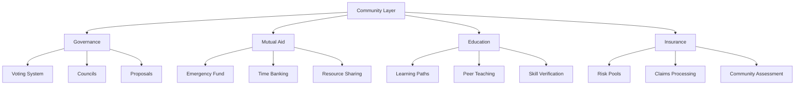

# 🏘️ Phase 3: Community (Months 7-9)

## Summary

Phase 3 builds robust community systems including mutual aid networks, insurance pools, democratic governance, and education platforms. We transform from a trading platform into a complete community-driven economic ecosystem supporting 50,000 active users.

## 📑 Table of Contents

- [Month 7: Mutual Aid Systems](#-month-7-mutual-aid-systems)
- [Month 8: Democratic Governance](#-month-8-democratic-governance)
- [Month 9: Education & Insurance](#-month-9-education--insurance)
- [Community Architecture](#-community-architecture)
- [Governance Framework](#-governance-framework)
- [Success Metrics](#-success-metrics)

## 📅 Month 7: Mutual Aid Systems

### Community Support Networks

```javascript
class MutualAidNetwork {
  constructor(env) {
    this.env = env;
    this.pools = new Map();
  }
  
  // Emergency assistance system
  async createEmergencyPool(community) {
    const pool = {
      id: crypto.randomUUID(),
      community: community.id,
      balance: 0,
      contributors: new Set(),
      guidelines: {
        maxRequest: 500, // KC
        cooldownPeriod: 30, // days
        approvalProcess: 'community_vote',
        eligibility: 'active_member'
      }
    };
    
    await this.env.DB.prepare(`
      INSERT INTO mutual_aid_pools (id, community_id, type, balance, guidelines)
      VALUES (?, ?, 'emergency', 0, ?)
    `).bind(pool.id, community.id, JSON.stringify(pool.guidelines)).run();
    
    return pool;
  }
  
  // Skill sharing marketplace
  async setupSkillSharing(community) {
    const skillShare = {
      tutoring: new SkillExchange('tutoring', 'knowledge_transfer'),
      mentorship: new SkillExchange('mentorship', 'career_development'),
      crafts: new SkillExchange('crafts', 'hands_on_learning'),
      digital: new SkillExchange('digital', 'tech_skills')
    };
    
    for (const [type, exchange] of Object.entries(skillShare)) {
      await exchange.initialize(community.id);
    }
    
    return skillShare;
  }
  
  // Time banking system
  async createTimeBank(community) {
    const timeBank = new TimeBankingSystem({
      community: community.id,
      rate: 1, // 1 KC per hour
      categories: [
        'childcare', 'eldercare', 'transportation',
        'home_repair', 'gardening', 'cooking'
      ]
    });
    
    await timeBank.initialize();
    return timeBank;
  }
}
```

### Resource Sharing Platform

```javascript
class ResourceSharing {
  // Community tool library
  async createToolLibrary(community) {
    const library = {
      tools: new Map(),
      checkoutSystem: new CheckoutManager(),
      maintenance: new MaintenanceTracker(),
      insurance: new ToolInsurance()
    };
    
    return library;
  }
  
  // Space sharing network
  async setupSpaceSharing(community) {
    const spaces = {
      coworking: new SpaceManager('coworking'),
      events: new SpaceManager('events'),
      storage: new SpaceManager('storage'),
      gardens: new SpaceManager('community_gardens')
    };
    
    return spaces;
  }
}
```

## 📅 Month 8: Democratic Governance

### Voting Systems

```javascript
class GovernanceSystem {
  constructor(env) {
    this.env = env;
    this.voting = new VotingEngine(env);
  }
  
  // Quadratic voting implementation
  async quadraticVoting(proposal, voter) {
    const votes = Math.sqrt(voter.credits_spent);
    const cost = Math.pow(votes, 2);
    
    if (voter.available_credits < cost) {
      throw new Error('Insufficient voting credits');
    }
    
    await this.env.DB.prepare(`
      INSERT INTO votes (proposal_id, voter_id, votes, cost)
      VALUES (?, ?, ?, ?)
    `).bind(proposal.id, voter.id, votes, cost).run();
    
    return { votes, cost };
  }
  
  // Liquid democracy
  async delegateVote(delegator, delegate, scope) {
    await this.env.DB.prepare(`
      INSERT INTO delegations (delegator_id, delegate_id, scope, active)
      VALUES (?, ?, ?, true)
      ON CONFLICT(delegator_id, scope) DO UPDATE SET
      delegate_id = excluded.delegate_id,
      updated_at = CURRENT_TIMESTAMP
    `).bind(delegator.id, delegate.id, scope).run();
    
    return { success: true, scope };
  }
  
  // Consensus building
  async buildConsensus(proposal) {
    const rounds = [
      { type: 'discussion', duration: 7 },
      { type: 'deliberation', duration: 3 },
      { type: 'voting', duration: 3 },
      { type: 'implementation', duration: 1 }
    ];
    
    return await this.runConsensusRounds(proposal, rounds);
  }
}
```

### Community Councils

```javascript
class CommunityCouncils {
  async electCouncil(community, position) {
    const election = {
      nominations: await this.collectNominations(community, position),
      campaign: await this.runCampaign(community, position),
      voting: await this.conductElection(community, position),
      results: await this.tallyResults(community, position)
    };
    
    return election;
  }
  
  // Council decision making
  async councilDecision(council, issue) {
    const process = {
      review: await this.reviewIssue(issue),
      discussion: await this.councilDiscussion(council, issue),
      vote: await this.councilVote(council, issue),
      implementation: await this.implementDecision(issue)
    };
    
    return process;
  }
}
```

## 📅 Month 9: Education & Insurance

### Learning Platform

```javascript
class LearningPlatform {
  constructor(env) {
    this.env = env;
    this.ai = env.AI;
  }
  
  // Personalized learning paths
  async createLearningPath(user, goals) {
    const path = await this.ai.run('@cf/meta/llama-2-7b-chat-int8', {
      messages: [{
        role: 'system',
        content: 'Create personalized learning curriculum for economic literacy.'
      }, {
        role: 'user',
        content: `User goals: ${JSON.stringify(goals)}`
      }]
    });
    
    return this.structureLearningPath(path.response, user);
  }
  
  // Peer-to-peer teaching
  async facilitateTeaching(teacher, students, subject) {
    const session = {
      teacher: teacher.id,
      students: students.map(s => s.id),
      subject,
      rewards: {
        teacher: 50, // KC per session
        students: 10 // KC completion bonus
      }
    };
    
    return await this.scheduleSession(session);
  }
}
```

### Insurance Pools

```javascript
class CommunityInsurance {
  constructor(env) {
    this.env = env;
    this.pools = {
      health: new HealthPool(),
      property: new PropertyPool(),
      income: new IncomePool(),
      care: new CarePool()
    };
  }
  
  // Risk pooling system
  async createInsurancePool(type, community) {
    const pool = {
      type,
      community: community.id,
      members: [],
      premiums: this.calculatePremiums(type),
      coverage: this.defineCoverage(type),
      claims: new ClaimsProcessor(type)
    };
    
    return await this.initializePool(pool);
  }
  
  // Claims processing
  async processClaim(claim) {
    const assessment = {
      eligibility: await this.checkEligibility(claim),
      amount: await this.calculatePayout(claim),
      approval: await this.communityApproval(claim)
    };
    
    if (assessment.approval) {
      await this.disburseFunds(claim, assessment.amount);
    }
    
    return assessment;
  }
}
```

## 🏗️ Community Architecture



## 🗳️ Governance Framework

### Decision Making Process

| Level | Scope | Method | Threshold |
|-------|-------|--------|-----------|
| Personal | Individual choices | Self-determination | N/A |
| Local | Community issues | Consensus | 80% agreement |
| Regional | Multi-community | Delegation + Vote | 60% majority |
| Network | System-wide | Quadratic voting | 2/3 majority |

### Proposal Types

```javascript
const proposalTypes = {
  policy: {
    example: 'Change transaction fees',
    process: 'Full democratic process',
    duration: 14 // days
  },
  
  budget: {
    example: 'Allocate community funds',
    process: 'Participatory budgeting',
    duration: 21
  },
  
  technical: {
    example: 'Platform upgrades',
    process: 'Expert review + vote',
    duration: 10
  },
  
  emergency: {
    example: 'Crisis response',
    process: 'Council decision',
    duration: 1
  }
};
```

## 📊 Success Metrics

### Community Health

```javascript
const communityMetrics = {
  participation: {
    votingTurnout: 70, // % of eligible voters
    proposalSubmissions: 50, // per month
    councilAttendance: 85, // % attendance
    consensusRate: 80 // % proposals reaching consensus
  },
  
  mutualAid: {
    poolContributions: 1000000, // KC total
    assistanceRequests: 200, // per month
    fulfillmentRate: 95, // % of requests met
    responseTime: 24 // hours average
  },
  
  education: {
    courseCompletions: 500, // per month
    peerSessions: 100, // per month
    skillVerifications: 200, // per month
    literacyGrowth: 25 // % improvement
  },
  
  insurance: {
    poolMembers: 25000, // users enrolled
    claimsProcessed: 50, // per month
    payoutRatio: 0.8, // claims paid / premiums
    satisfactionScore: 4.2 // out of 5
  }
};
```

### Economic Impact

```javascript
const economicMetrics = {
  circulation: {
    totalVolume: 10000000, // KC per month
    velocity: 4, // circulation rate
    coverage: 80 // % of users active
  },
  
  distribution: {
    giniCoefficient: 0.35, // wealth distribution
    basicIncome: 200, // KC per month guaranteed
    wealthBuilding: 15 // % users building wealth
  },
  
  sustainability: {
    poolGrowth: 10, // % monthly growth
    retention: 90, // % user retention
    satisfaction: 4.5 // user satisfaction
  }
};
```

## 🎯 Phase 3 Deliverables

### Technical Systems
- [x] Mutual aid platform
- [x] Democratic voting system
- [x] Learning management system
- [x] Insurance pool management
- [x] Governance dashboard
- [x] Community analytics

### Community Features
- [x] Emergency assistance network
- [x] Time banking system
- [x] Resource sharing platform
- [x] Skill verification system
- [x] Peer education network
- [x] Community insurance pools

### Governance Implementation
- [x] Quadratic voting deployed
- [x] Liquid democracy active
- [x] Council elections held
- [x] Proposal system operational
- [x] Consensus mechanisms working
- [x] Community moderation active

## 📚 Related Documentation

- **[← Phase 2: Intelligence](PHASE-2-INTELLIGENCE.md)** - AI systems
- **[Capitalism Replacement](../CAPITALISM-REPLACEMENT.md)** - Economic transformation
- **[Why It Works](../WHY-IT-WORKS.md)** - Economic principles
- **[Phase 4: Scale →](PHASE-4-SCALE.md)** - Next phase

---

**Community empowered. Democracy activated. 🏘️✊**