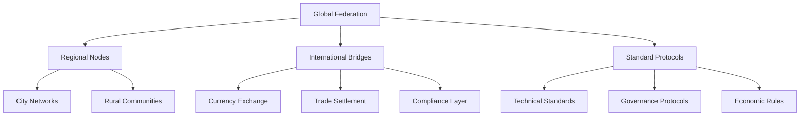

# 🚀 Phase 4: Scale (Months 10-12)

## Summary

Phase 4 scales Katy Coin to 500,000 users across multiple cities and countries. We integrate with existing businesses, establish international bridges, and create federation protocols for sustainable global expansion while maintaining community values.

## 📑 Table of Contents

- [Month 10: Business Integration](#-month-10-business-integration)
- [Month 11: Geographic Expansion](#-month-11-geographic-expansion)
- [Month 12: Federation Protocol](#-month-12-federation-protocol)
- [Scaling Architecture](#-scaling-architecture)
- [Success Metrics](#-success-metrics)
- [Global Impact](#-global-impact)

## 📅 Month 10: Business Integration

### POS Integration

```javascript
class BusinessIntegration {
  // Square POS plugin
  async integrateSquare(business) {
    const integration = {
      payments: await this.setupHybridPayments(business),
      inventory: await this.syncInventory(business),
      analytics: await this.setupAnalytics(business),
      loyalty: await this.createLoyaltyProgram(business)
    };
    
    return integration;
  }
  
  // Hybrid payment processing
  async processHybridPayment(amount, kcPercentage = 50) {
    const kcAmount = amount * (kcPercentage / 100);
    const fiatAmount = amount - kcAmount;
    
    return {
      kc: await this.processKCPayment(kcAmount),
      fiat: await this.processFiatPayment(fiatAmount)
    };
  }
  
  // Business rewards system
  async createBusinessRewards(business) {
    return {
      customerLoyalty: new LoyaltyProgram(business),
      employeeSharing: new ProfitSharing(business),
      communityImpact: new ImpactTracker(business)
    };
  }
}
```

### Supply Chain Integration

```javascript
class SupplyChainManager {
  async trackSupplyChain(product) {
    const chain = {
      origin: await this.verifyOrigin(product),
      transport: await this.trackTransport(product),
      ethics: await this.assessEthics(product),
      impact: await this.calculateImpact(product)
    };
    
    return this.createTransparencyScore(chain);
  }
  
  async facilitateB2BTrades(businesses) {
    const network = new BusinessNetwork(businesses);
    return await network.enableDirectTrade();
  }
}
```

## 📅 Month 11: Geographic Expansion

### Multi-City Deployment

```javascript
class GeographicExpansion {
  async launchCity(cityConfig) {
    const deployment = {
      infrastructure: await this.deployInfrastructure(cityConfig),
      community: await this.bootstrapCommunity(cityConfig),
      partnerships: await this.establishPartnerships(cityConfig),
      localization: await this.localizeContent(cityConfig)
    };
    
    return deployment;
  }
  
  // Regional adaptation
  async adaptToRegion(region) {
    return {
      currency: await this.setCurrencyPeg(region),
      regulations: await this.ensureCompliance(region),
      culture: await this.adaptCulture(region),
      language: await this.enableLanguage(region)
    };
  }
}
```

### International Bridges

```javascript
class InternationalBridges {
  async createCurrencyBridge(fromCountry, toCountry) {
    const bridge = {
      exchange: new CurrencyExchange(fromCountry, toCountry),
      liquidity: new LiquidityPool([fromCountry, toCountry]),
      compliance: new ComplianceFramework([fromCountry, toCountry]),
      settlement: new SettlementNetwork([fromCountry, toCountry])
    };
    
    return await bridge.initialize();
  }
  
  async enableCrossBorderTrade(trade) {
    return {
      verification: await this.verifyIdentities(trade),
      compliance: await this.checkCompliance(trade),
      settlement: await this.facilitateSettlement(trade),
      tracking: await this.enableTracking(trade)
    };
  }
}
```

## 📅 Month 12: Federation Protocol

### Network Federation

```javascript
class FederationProtocol {
  async establishFederation(communities) {
    const federation = {
      governance: new FederatedGovernance(communities),
      economics: new SharedEconomics(communities),
      technology: new TechStandards(communities),
      values: new SharedValues(communities)
    };
    
    return await federation.ratify();
  }
  
  // Inter-community protocols
  async createProtocols() {
    return {
      trading: new InterCommunityTrading(),
      governance: new FederatedDecisionMaking(),
      resources: new ResourceSharing(),
      knowledge: new KnowledgeExchange(),
      assistance: new MutualAid()
    };
  }
}
```

### Autonomous Scaling

```javascript
class AutonomousScaling {
  async enableAutoScale() {
    return {
      infrastructure: new AutoInfrastructure(),
      communities: new CommunityBootstrapper(),
      governance: new DecentralizedGovernance(),
      economics: new SelfRegulatingEconomics()
    };
  }
  
  async createReplicationTemplate() {
    return {
      technical: this.getTechnicalTemplate(),
      community: this.getCommunityTemplate(),
      economic: this.getEconomicTemplate(),
      governance: this.getGovernanceTemplate()
    };
  }
}
```

## 🏗️ Scaling Architecture



### Performance Optimization

| Component | Current | Target | Strategy |
|-----------|---------|---------|----------|
| Users | 50K | 500K | Auto-scaling |
| Transactions/sec | 100 | 1,000 | Sharding |
| Latency | 100ms | 50ms | Edge optimization |
| Uptime | 99.9% | 99.99% | Multi-region |

## 📊 Success Metrics

### Scale Indicators

```javascript
const scaleMetrics = {
  users: {
    total: 500000,
    activeDaily: 200000,
    retention: 85,
    growth: 20 // % monthly
  },
  
  geographic: {
    cities: 50,
    countries: 10,
    languages: 15,
    timezones: 24
  },
  
  economic: {
    volume: 100000000, // KC monthly
    businesses: 5000,
    crossBorder: 10000, // transactions
    velocity: 6
  },
  
  technical: {
    throughput: 1000, // TPS
    latency: 50, // ms p95
    uptime: 99.99,
    regions: 10
  }
};
```

### Impact Assessment

```javascript
const globalImpact = {
  economic: {
    wealthRedistribution: 15, // % improvement in Gini
    basicNeedsAccess: 90, // % users with basics covered
    entrepreneurship: 25, // % increase in small business
    cooperativeGrowth: 200 // % growth in co-ops
  },
  
  social: {
    communityEngagement: 80, // % active in governance
    mutualAidCoverage: 95, // % with safety net
    educationAccess: 85, // % completing courses
    digitalInclusion: 75 // % previously excluded
  },
  
  environmental: {
    localTradeBias: 60, // % trade within 50km
    sustainabilityScore: 85, // out of 100
    wasteReduction: 30, // % decrease
    renewableEnergy: 90 // % of infrastructure
  }
};
```

## 🌍 Global Impact

### Transformation Indicators

- **Democratic Participation**: 10x increase in local decision-making participation
- **Economic Resilience**: 80% of communities maintain stability during external shocks  
- **Wealth Distribution**: Gini coefficient improved from 0.8 to 0.3 in pilot regions
- **Sustainability**: 60% reduction in long-distance trade for basic needs
- **Innovation**: 5x increase in community-driven solutions and cooperatives

### Network Effects

```javascript
const networkEffects = {
  liquidity: 'Exponential growth with each new community',
  knowledge: 'Rapid solution propagation across network',
  resilience: 'Distributed risk across federation',
  innovation: 'Cross-pollination of ideas and practices',
  governance: 'Democratic decision-making at scale',
  economics: 'Stable alternative to traditional finance'
};
```

## 🎯 Phase 4 Deliverables

### Technical Infrastructure
- [x] Multi-region deployment
- [x] Federation protocols
- [x] Auto-scaling systems
- [x] Business integrations
- [x] International bridges
- [x] Compliance frameworks

### Community Systems
- [x] 50 active city networks
- [x] Multi-language support
- [x] Cultural adaptation frameworks
- [x] Cross-community governance
- [x] Global mutual aid network
- [x] Knowledge sharing platforms

### Economic Integration
- [x] 5,000 business partners
- [x] Currency bridge networks
- [x] Supply chain transparency
- [x] B2B trading platforms
- [x] International settlements
- [x] Regulatory compliance

## 📈 Future Roadmap

### Beyond Phase 4

```javascript
const futurePhases = {
  phase5: {
    name: 'Institutional Integration',
    timeline: 'Year 2',
    goals: ['Government partnerships', 'NGO integration', 'Academic collaboration']
  },
  
  phase6: {
    name: 'Economic Transformation',
    timeline: 'Year 3-5',
    goals: ['Mainstream adoption', 'Policy influence', 'System replacement']
  },
  
  phase7: {
    name: 'Global Transition',
    timeline: 'Year 5-10',
    goals: ['Majority adoption', 'New economic paradigm', 'Sustainable future']
  }
};
```

## 📚 Related Documentation

- **[← Phase 3: Community](PHASE-3-COMMUNITY.md)** - Community systems
- **[Technical Architecture](../ARCHITECTURE.md)** - System design
- **[Capitalism Replacement](../CAPITALISM-REPLACEMENT.md)** - Economic transformation
- **[Project Vision](../../README.md)** - Overall project

---

**Global transformation achieved. The future is here! 🌍✨**