# 🎯 User Stories Priority Roadmap

## 📋 Overview
This roadmap organizes all user stories across the four user types by priority, implementation phase, and business value. Stories are categorized using the MoSCoW method and aligned with the Katy Coin implementation phases.

## 📚 Table of Contents
- [📋 Overview](#-overview)
- [Priority Framework](#priority-framework)
- [🟠 High Priority (Should Have - Phase 2)](#-high-priority-should-have---phase-2)
- [🟡 Medium Priority (Could Have - Phase 3)](#-medium-priority-could-have---phase-3)
- [🟢 Low Priority (Won't Have Initially - Phase 4+)](#-low-priority-wont-have-initially---phase-4)
- [📊 Implementation Matrix](#-implementation-matrix)
- [🎯 Quick Wins (Implement First)](#-quick-wins-implement-first)
- [🚀 MVP Definition](#-mvp-definition)
- [📈 Value Metrics](#-value-metrics)
- [🔄 Dependency Map](#-dependency-map)
- [🎬 Next Steps](#-next-steps)
- [📝 Story Estimation Guide](#-story-estimation-guide)
## 🔗 Related Documentation

- **[User Stories Overview](README.md)** - Complete user story collection
- **[Sprint Planning](sprint-planning.md)** - Detailed sprint breakdown
- **[Phase 1: Foundation](../phases/PHASE-1-FOUNDATION.md)** - Core infrastructure priorities
- **[Phase 2: Intelligence](../phases/PHASE-2-INTELLIGENCE.md)** - AI integration priorities
- **[Phase 3: Community](../phases/PHASE-3-COMMUNITY.md)** - Community system priorities
- **[Technical Architecture](../ARCHITECTURE.md)** - System design priorities

- [Success Criteria](#success-criteria)
- [Conclusion](#conclusion)

---

## Priority Framework

### 🔴 Critical Priority (Must Have - Phase 1)
**Timeline:** Months 1-3  
**Goal:** Core functionality for basic trading

#### End User Stories
1. **Create User Account** - Foundation for all features
2. **Browse Public Listings** - Essential discovery
3. **Post Items/Services** - Core value creation
4. **Search and Filter** - Basic usability
5. **Initiate Direct Trade** - Primary transaction method
6. **View Transaction History** - Trust and tracking

#### Business Stories
1. **Business Registration** - Enable B2B participation
2. **Sync Basic Inventory** - Product availability
3. **Accept Hybrid Payments** - KC/fiat flexibility
4. **Generate Tax Reports** - Compliance requirement

#### Developer Stories
1. **Authentication System** - Security foundation
2. **API Documentation** - Integration enablement
3. **Error Handling** - System stability

#### Community Manager Stories
1. **Create Community Hub** - Group formation
2. **Set Community Guidelines** - Governance basics

---

## 🟠 High Priority (Should Have - Phase 2)
**Timeline:** Months 4-6  
**Goal:** Enhanced user experience and intelligence

#### End User Stories
1. **Profile Management** - Identity and trust
2. **Reputation System** - Trust building
3. **Multi-Party Trading** - Complex transactions
4. **Mobile Optimization** - Accessibility
5. **Smart Notifications** - Engagement
6. **Location-Based Discovery** - Local focus

#### Business Stories
1. **Advanced Analytics Dashboard** - Business intelligence
2. **Employee Management** - Team coordination
3. **Bulk Operations** - Efficiency at scale
4. **Square POS Integration** - Seamless checkout
5. **Inventory Predictions** - Smart restocking

#### Developer Stories
1. **SDK Development** - Third-party integration
2. **Webhook System** - Real-time integration
3. **Rate Limiting** - API protection
4. **Testing Framework** - Quality assurance

#### Community Manager Stories
1. **Mutual Aid Pools** - Community support
2. **Event Management** - Community building
3. **Member Analytics** - Growth tracking
4. **Communication Tools** - Engagement

---

## 🟡 Medium Priority (Could Have - Phase 3)
**Timeline:** Months 7-9  
**Goal:** Community systems and governance

#### End User Stories
1. **Time Banking** - Alternative value exchange
2. **Skill Verification** - Expertise validation
3. **Want Alerts** - Automated matching
4. **Social Features** - Community engagement
5. **Learning Paths** - Skill development
6. **Insurance Participation** - Risk mitigation

#### Business Stories
1. **B2B Marketplace** - Business networking
2. **Supply Chain Tracking** - Transparency
3. **Custom Reports** - Specific insights
4. **Loyalty Programs** - Customer retention
5. **API Custom Integration** - Flexibility

#### Developer Stories
1. **Plugin System** - Extensibility
2. **Custom Themes** - Branding
3. **Performance Monitoring** - Optimization
4. **Security Auditing** - Vulnerability detection

#### Community Manager Stories
1. **Democratic Voting** - Decision making
2. **Resource Library** - Shared assets
3. **Education Programs** - Knowledge sharing
4. **Insurance Pools** - Risk sharing
5. **Dispute Resolution** - Conflict management

#### Privacy Stories
1. **Advanced Privacy Controls** - Granular settings
2. **Anonymous Trading** - Private transactions
3. **Data Portability** - User ownership
4. **Consent Management** - GDPR compliance

---

## 🟢 Low Priority (Won't Have Initially - Phase 4+)
**Timeline:** Months 10+  
**Goal:** Scale and advanced features

#### End User Stories
1. **AI Personal Assistant** - Automated trading
2. **Voice Commands** - Accessibility
3. **AR Product Preview** - Enhanced experience
4. **Gamification** - Engagement mechanics
5. **Cross-Border Trading** - International reach

#### Business Stories
1. **AI Demand Forecasting** - Predictive analytics
2. **Automated Pricing** - Dynamic optimization
3. **White Label Solution** - Custom branding
4. **Blockchain Analytics** - Deep insights
5. **Multi-Currency Support** - Global expansion

#### Developer Stories
1. **GraphQL Support** - Modern API
2. **AI Model Training** - Custom intelligence
3. **Blockchain Development** - Direct integration
4. **Edge Computing** - Performance optimization

#### Community Manager Stories
1. **Federation Protocol** - Inter-community bridges
2. **Global Governance** - Network-wide decisions
3. **Cultural Adaptation** - Localization
4. **Research Tools** - Data analysis
5. **Impact Measurement** - Social metrics

---

## 📊 Implementation Matrix

| Phase | Duration | User Stories | Priority | Success Metrics |
|-------|----------|--------------|----------|-----------------|
| Foundation | Months 1-3 | 15 stories | Critical | 1,000 users, 10K trades |
| Intelligence | Months 4-6 | 20 stories | High | 10,000 users, 100K trades |
| Community | Months 7-9 | 25 stories | Medium | 50,000 users, 500K trades |
| Scale | Months 10-12 | 20 stories | Low | 500,000 users, 5M trades |

---

## 🎯 Quick Wins (Implement First)

### Week 1-2 Sprint
1. User registration and login
2. Basic listing creation
3. Simple search functionality
4. Profile creation

### Week 3-4 Sprint
1. Direct trading mechanism
2. Transaction history
3. Basic notifications
4. Community creation

### Week 5-6 Sprint
1. Business registration
2. Inventory import (CSV)
3. Basic reporting
4. Mobile responsive design

---

## 🚀 MVP Definition

### Minimum Viable Product (3 months)
**End Users:**
- Account management ✓
- Browse/search listings ✓
- Create offers/wants ✓
- Complete trades ✓
- Basic reputation ✓

**Businesses:**
- Business accounts ✓
- Inventory management ✓
- Accept payments ✓
- Tax reporting ✓

**Community:**
- Create communities ✓
- Set guidelines ✓
- Member management ✓

**Developers:**
- REST API ✓
- Documentation ✓
- Basic SDKs ✓

---

## 📈 Value Metrics

### Business Value Scoring
**10 - Revolutionary:** Multi-party trades, AI matching
**8 - Transformative:** Community governance, mutual aid
**6 - Significant:** Business integration, analytics
**4 - Important:** Privacy controls, notifications
**2 - Nice to Have:** Gamification, voice commands

### Technical Complexity
**High:** Blockchain integration, AI models, multi-party trades
**Medium:** Payment processing, real-time sync, analytics
**Low:** User profiles, search, notifications

### User Impact
**Critical:** Core trading, account security, payment processing
**High:** Discovery, reputation, community features
**Medium:** Analytics, advanced privacy, education
**Low:** Gamification, AR features, voice control

---

## 🔄 Dependency Map

```mermaid
graph TD
    %% Foundation Layer
    A[🔐 Authentication] --> B[👤 User Profiles]
    A --> C[📋 Listings]
    A --> D[💳 Transactions]
    B --> E[⭐ Reputation]
    E --> F[🤝 Trust Network]
    C --> G[🔍 Search]
    G --> H[🎯 Discovery]
    H --> I[🎲 Matching]
    D --> J[📊 History]
    J --> K[📈 Analytics]
    K --> L[💡 Insights]
    
    %% Business Layer
    M[🏢 Business Accounts] --> N[📦 Inventory]
    N --> O[🛒 POS Integration]
    P[💰 Payment Processing] --> Q[📄 Tax Reports]
    Q --> R[⚖️ Compliance]
    S[📊 Analytics] --> T[🔮 Predictions]
    T --> U[⚡ Optimization]
    
    %% Community Layer
    V[🏘️ Communities] --> W[🗳️ Governance]
    W --> X[📊 Voting]
    X --> Y[🎯 Decisions]
    Z[🤲 Mutual Aid] --> AA[🛡️ Insurance]
    AA --> BB[⚖️ Risk Pooling]
    CC[📚 Education] --> DD[🎓 Skills]
    DD --> EE[✅ Verification]
    EE --> FF[💎 Value]
    
    %% Developer Layer
    GG[🔌 API] --> HH[🛠️ SDK]
    HH --> II[🔧 Plugins]
    II --> JJ[📱 Extensions]
    KK[📖 Documentation] --> LL[🔗 Integration]
    LL --> MM[📈 Adoption]
    NN[🔒 Security] --> OO[🔐 Privacy]
    OO --> PP[🤝 Trust]
    PP --> QQ[🚀 Growth]
    
    classDef foundation fill:#e1f5fe
    classDef business fill:#f3e5f5
    classDef community fill:#e8f5e8
    classDef developer fill:#fff3e0
    
    class A,B,C,D,E,F,G,H,I,J,K,L foundation
    class M,N,O,P,Q,R,S,T,U business
    class V,W,X,Y,Z,AA,BB,CC,DD,EE,FF community
    class GG,HH,II,JJ,KK,LL,MM,NN,OO,PP,QQ developer
```

---

## 🎬 Next Steps

### Immediate Actions (This Week)
1. Set up development environment
2. Create user authentication system
3. Build basic listing database
4. Design API structure
5. Create initial UI mockups

### Short Term (Month 1)
1. Complete core trading functionality
2. Launch alpha with 100 test users
3. Implement basic business features
4. Establish first community
5. Release API documentation

### Medium Term (Months 2-3)
1. Scale to 1,000 users
2. Add payment processing
3. Implement reputation system
4. Launch mobile apps
5. Enable community governance

### Long Term (Months 4+)
1. AI integration
2. Blockchain settlement
3. International expansion
4. Advanced analytics
5. Federation protocol

---

## 📝 Story Estimation Guide

### Story Points
- **1 Point:** Simple UI change, configuration update
- **2 Points:** Basic CRUD operation, simple integration
- **3 Points:** Complex business logic, API endpoint
- **5 Points:** Major feature, system integration
- **8 Points:** AI/blockchain integration, architecture change
- **13 Points:** Complete subsystem, major infrastructure

### Velocity Targets
- **Sprint 1-2:** 15-20 points (learning phase)
- **Sprint 3-6:** 25-30 points (ramping up)
- **Sprint 7+:** 35-40 points (full velocity)

---

## Success Criteria

### Phase 1 Success
- [ ] 1,000 registered users
- [ ] 10,000 successful trades
- [ ] 100 active businesses
- [ ] 5 communities formed
- [ ] 95% uptime achieved

### Phase 2 Success
- [ ] 10,000 active users
- [ ] AI matching 50% of trades
- [ ] 500 businesses integrated
- [ ] 20 communities active
- [ ] Mobile app launched

### Phase 3 Success
- [ ] 50,000 users engaged
- [ ] Democratic governance active
- [ ] Mutual aid pools funded
- [ ] Insurance system operational
- [ ] Education platform launched

### Phase 4 Success
- [ ] 500,000 users worldwide
- [ ] 10 cities connected
- [ ] Federation protocol active
- [ ] Self-sustaining economy
- [ ] Measurable social impact

---

## Conclusion
This roadmap provides a clear path from MVP to global scale, prioritizing features that deliver immediate value while building toward the revolutionary vision of Katy Coin. Regular review and adjustment of priorities based on user feedback and market conditions will be essential for success.