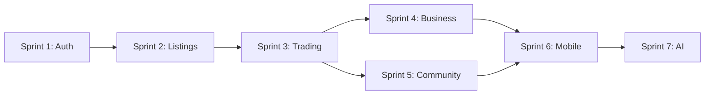

# 🏃 Sprint Planning Guide

## Overview
This document provides detailed sprint planning for the first 6 months of Katy Coin development, breaking down user stories into 2-week sprints with clear deliverables and success criteria.

## 📑 Table of Contents

- [📋 Sprint Planning Template](#-sprint-planning-template)
- [🚀 Phase 1: Foundation (Months 1-3)](#-phase-1-foundation-months-1-3)
- [🎯 Phase 2: Intelligence (Months 4-6)](#-phase-2-intelligence-months-4-6)
- [📊 Sprint Metrics & KPIs](#-sprint-metrics--kpis)
- [🔄 Sprint Dependencies](#-sprint-dependencies)
- [🚨 Risk Management](#-risk-management)
- [📝 Sprint Ceremonies](#-sprint-ceremonies)
- [🎯 Definition of Ready](#-definition-of-ready)
- [✅ Definition of Done](#-definition-of-done)
- [🚀 Launch Criteria](#-launch-criteria)
- [📚 Resources](#-resources)
## 🔗 Related Documentation

- **[User Stories Overview](README.md)** - Complete user story collection
- **[Phase 1: Foundation](../phases/PHASE-1-FOUNDATION.md)** - Core infrastructure sprint details
- **[Phase 2: Intelligence](../phases/PHASE-2-INTELLIGENCE.md)** - AI integration sprint details
- **[Technical Architecture](../ARCHITECTURE.md)** - Implementation technical details
- **[Priority Roadmap](priority-roadmap.md)** - Feature prioritization framework

- [🔄 Next Steps](#-next-steps)

---

## 📋 Sprint Planning Template

### Sprint Structure
- **Duration:** 2 weeks (10 working days)
- **Ceremonies:** Planning (Day 1), Daily Standups, Review (Day 9), Retrospective (Day 10)
- **Team Size:** 5-7 developers, 1 product owner, 1 scrum master
- **Velocity Target:** 30-40 story points per sprint

---

## 🚀 Phase 1: Foundation (Months 1-3)

### Sprint 1: Authentication & User Management
**Dates:** Weeks 1-2  
**Goal:** Establish secure user authentication and basic account management

#### User Stories (32 points)
1. **User Registration** (5 points)
   - Email/password registration
   - Email verification
   - Terms acceptance
   
2. **User Login** (3 points)
   - Secure authentication
   - Password reset
   - Remember me option
   
3. **Profile Creation** (5 points)
   - Basic information
   - Avatar upload
   - Location setting
   
4. **Database Schema** (8 points)
   - User tables
   - Security indexes
   - Initial migrations
   
5. **API Foundation** (8 points)
   - REST structure
   - Authentication middleware
   - Error handling
   
6. **Basic UI Framework** (3 points)
   - Layout components
   - Navigation structure
   - Responsive design

#### Definition of Done
- [ ] All tests passing (>80% coverage)
- [ ] Security review completed
- [ ] Documentation updated
- [ ] Code reviewed and merged
- [ ] Deployed to staging

---

### Sprint 2: Listings & Discovery
**Dates:** Weeks 3-4  
**Goal:** Enable users to create and browse listings

#### User Stories (35 points)
1. **Create Offer Listing** (5 points)
   - Form validation
   - Image upload
   - Category selection
   
2. **Create Want Listing** (5 points)
   - Requirements specification
   - Budget range
   - Urgency indicator
   
3. **Browse Public Listings** (3 points)
   - Grid/list view
   - Pagination
   - Quick preview
   
4. **Search Functionality** (5 points)
   - Text search
   - Category filter
   - Location filter
   
5. **Listing Details Page** (3 points)
   - Full description
   - Image gallery
   - Contact options
   
6. **Database Optimization** (8 points)
   - Search indexes
   - Query optimization
   - Caching strategy
   
7. **API Endpoints** (6 points)
   - CRUD operations
   - Search endpoint
   - Filter logic

#### Success Metrics
- Users can create listings within 2 minutes
- Search returns results in <200ms
- 95% form completion rate

---

### Sprint 3: Trading Mechanism
**Dates:** Weeks 5-6  
**Goal:** Implement core trading functionality

#### User Stories (38 points)
1. **Initiate Trade Request** (8 points)
   - Trade proposal
   - Terms negotiation
   - Escrow setup
   
2. **Accept/Reject Trade** (5 points)
   - Notification system
   - Accept/reject flow
   - Counter-offer option
   
3. **Transaction Processing** (8 points)
   - Balance updates
   - Transaction logging
   - Confirmation emails
   
4. **Transaction History** (5 points)
   - List view
   - Detail view
   - Export functionality
   
5. **Basic Notifications** (5 points)
   - Email notifications
   - In-app alerts
   - Preference settings
   
6. **Error Handling** (7 points)
   - Transaction rollback
   - Error messages
   - Recovery procedures

#### Risk Mitigation
- Implement transaction locks
- Add rollback mechanisms
- Create audit trail

---

### Sprint 4: Business Registration
**Dates:** Weeks 7-8  
**Goal:** Enable business participation

#### User Stories (34 points)
1. **Business Account Creation** (8 points)
   - Business verification
   - Tax ID validation
   - Multi-user support
   
2. **Inventory Import** (8 points)
   - CSV upload
   - Data validation
   - Bulk operations
   
3. **Business Dashboard** (5 points)
   - Overview metrics
   - Recent activity
   - Quick actions
   
4. **Hybrid Payment Setup** (8 points)
   - Payment configuration
   - KC/USD split options
   - Fee structure
   
5. **Basic Reporting** (5 points)
   - Transaction summary
   - Tax report
   - Export options

---

### Sprint 5: Community Features
**Dates:** Weeks 9-10  
**Goal:** Establish community infrastructure

#### User Stories (36 points)
1. **Create Community Hub** (8 points)
   - Community creation
   - Member invitation
   - Role assignment
   
2. **Community Guidelines** (5 points)
   - Rules editor
   - Member agreement
   - Violation reporting
   
3. **Community Dashboard** (5 points)
   - Member list
   - Activity feed
   - Statistics
   
4. **Private Listings** (8 points)
   - Privacy controls
   - Community-only trades
   - Access management
   
5. **Member Management** (5 points)
   - Add/remove members
   - Role changes
   - Ban/suspend options
   
6. **Community Analytics** (5 points)
   - Growth metrics
   - Trade volume
   - Member engagement

---

### Sprint 6: Mobile & Polish
**Dates:** Weeks 11-12  
**Goal:** Mobile optimization and MVP refinement

#### User Stories (35 points)
1. **Mobile Responsive Design** (8 points)
   - Touch optimization
   - Responsive layouts
   - Mobile navigation
   
2. **PWA Implementation** (8 points)
   - Service workers
   - Offline capability
   - App manifest
   
3. **Performance Optimization** (8 points)
   - Code splitting
   - Image optimization
   - Lazy loading
   
4. **Security Hardening** (6 points)
   - Penetration testing
   - Security headers
   - Rate limiting
   
5. **User Onboarding** (5 points)
   - Welcome flow
   - Tutorial system
   - Help documentation

---

## 🎯 Phase 2: Intelligence (Months 4-6)

### Sprint 7-8: AI Integration
**Focus:** Smart matching and valuation

#### Key Deliverables
- AI-powered trade matching
- Automated valuation system
- Semantic search
- Recommendation engine

### Sprint 9-10: Advanced Business Features
**Focus:** Business intelligence and automation

#### Key Deliverables
- Advanced analytics dashboard
- Inventory predictions
- Square POS integration
- Automated tax reporting

### Sprint 11-12: Enhanced User Experience
**Focus:** Engagement and retention

#### Key Deliverables
- Smart notifications
- Reputation system
- Social features
- Mobile apps (iOS/Android)

---

## 📊 Sprint Metrics & KPIs

### Velocity Tracking
| Sprint | Planned | Completed | Velocity | Notes |
|--------|---------|-----------|----------|-------|
| 1 | 32 | TBD | TBD | Foundation |
| 2 | 35 | TBD | TBD | Discovery |
| 3 | 38 | TBD | TBD | Trading |
| 4 | 34 | TBD | TBD | Business |
| 5 | 36 | TBD | TBD | Community |
| 6 | 35 | TBD | TBD | Mobile |

### Quality Metrics
- **Code Coverage:** >80%
- **Bug Escape Rate:** <5%
- **Technical Debt Ratio:** <10%
- **Performance:** <200ms API response
- **Availability:** >99.9% uptime

### Team Health
- **Sprint Goal Achievement:** >90%
- **Story Completion Rate:** >85%
- **Team Satisfaction:** >4/5
- **Stakeholder Satisfaction:** >4/5

---

## 🔄 Sprint Dependencies

---

## 🚨 Risk Management

### Technical Risks
| Risk | Impact | Probability | Mitigation |
|------|--------|-------------|------------|
| Scalability issues | High | Medium | Load testing, auto-scaling |
| Security breach | High | Low | Security audits, pen testing |
| Integration failures | Medium | Medium | API versioning, fallbacks |
| Performance degradation | Medium | Medium | Monitoring, optimization |

### Process Risks
| Risk | Impact | Probability | Mitigation |
|------|--------|-------------|------------|
| Scope creep | High | High | Strict sprint planning |
| Team burnout | High | Medium | Sustainable pace |
| Requirements change | Medium | High | Agile adaptation |
| Technical debt | Medium | Medium | Refactoring sprints |

---

## 📝 Sprint Ceremonies

### Sprint Planning (Day 1)
1. Review product backlog
2. Define sprint goal
3. Select user stories
4. Break down into tasks
5. Estimate effort
6. Commit to sprint backlog

### Daily Standup (Daily)
1. What did I complete yesterday?
2. What will I work on today?
3. Are there any blockers?

### Sprint Review (Day 9)
1. Demo completed features
2. Gather stakeholder feedback
3. Update product backlog
4. Celebrate achievements

### Sprint Retrospective (Day 10)
1. What went well?
2. What could improve?
3. Action items for next sprint
4. Team health check

---

## 🎯 Definition of Ready

A user story is ready when:
- [ ] Acceptance criteria defined
- [ ] UI/UX designs completed (if applicable)
- [ ] Technical approach agreed
- [ ] Dependencies identified
- [ ] Story estimated
- [ ] Test scenarios documented

## ✅ Definition of Done

A user story is done when:
- [ ] Code completed and reviewed
- [ ] Unit tests written (>80% coverage)
- [ ] Integration tests passing
- [ ] Documentation updated
- [ ] Deployed to staging
- [ ] Acceptance criteria verified
- [ ] No critical bugs
- [ ] Performance benchmarks met

---

## 🚀 Launch Criteria

### MVP Launch (End of Month 3)
- [ ] Core trading functional
- [ ] 1,000 beta users onboarded
- [ ] Business integration working
- [ ] Community features active
- [ ] Mobile responsive
- [ ] Security audit passed
- [ ] Performance targets met
- [ ] Documentation complete

### Public Launch (End of Month 6)
- [ ] AI features operational
- [ ] 10,000 active users
- [ ] 100 businesses integrated
- [ ] Mobile apps published
- [ ] Governance active
- [ ] Insurance pools funded
- [ ] International support
- [ ] 99.9% uptime achieved

---

## 📚 Resources

### Team Resources
- **Product Owner:** Defines requirements, prioritizes backlog
- **Scrum Master:** Facilitates ceremonies, removes blockers
- **Tech Lead:** Technical decisions, architecture
- **Developers:** Implementation, testing
- **UX Designer:** User experience, interfaces
- **QA Engineer:** Testing, quality assurance
- **DevOps:** Infrastructure, deployment

### Tools & Platforms
- **Project Management:** Jira/Linear
- **Code Repository:** GitHub
- **CI/CD:** GitHub Actions
- **Communication:** Slack
- **Documentation:** Confluence/Notion
- **Monitoring:** DataDog/NewRelic
- **Analytics:** Mixpanel/Amplitude

---

## 🔄 Next Steps

1. **Immediate (This Week):**
   - Finalize team composition
   - Set up development environment
   - Create project repositories
   - Configure CI/CD pipeline
   - Schedule Sprint 1 planning

2. **Sprint 1 Preparation:**
   - Complete technical designs
   - Set up infrastructure
   - Prepare test data
   - Create UI mockups
   - Define API contracts

3. **Ongoing:**
   - Daily standups
   - Weekly stakeholder updates
   - Bi-weekly sprint cycles
   - Monthly progress reviews
   - Quarterly planning sessions